# Current Architecture State

> วิเคราะห์ ณ commit: `40367af` · วันที่: 2026-06-15 · รวม 25 repo

---

## 1. Inventory

| # | Repo | Group | Type | Stack | Port |
|---|------|-------|------|-------|------|
| 1 | `3rd-payment` | payment | API gateway | Go 1.25, Gin | 8081 |
| 2 | `que_payment` | payment | worker-consumer | Go 1.25 | — |
| 3 | `3rd-gateway` | payment | API gateway | Go 1.23, Gin | 8000 |
| 4 | `go_deposit` | deposit | worker-consumer | Go (RabbitMQ) | — |
| 5 | `running-bank` | deposit | cronjob/poller | Go | — |
| 6 | `hash-central` | deposit | API service | Go, Gin | 8001 |
| 7 | `go_sms` | deposit | dual-mode (HTTP+MQ) | Go 1.24, Gin | 8000 |
| 8 | `withdraw-auto` | withdraw | worker-consumer | Go | — |
| 9 | `queue-withdraw-go` | withdraw | worker-consumer | Go 1.22.4 | — |
| 10 | `affiliate_standalone` | affiliate | API+cronjob | Go, 30+ cron | 4042 |
| 11 | `hydra-affilaite` | affiliate | API service | Go, Gin | 5053 |
| 12 | `queue-dynamic-go` | affiliate | worker-consumer | Go 1.19 | — |
| 13 | `hydra-hyperx-web` | affiliate | frontend SPA | Nuxt 2, Vue 2 | 8900 |
| 14 | `go_report` | report | worker-consumer | Go 1.15 | — |
| 15 | `sub_statement` | report | worker-consumer | Go, Gin | Prometheus only |
| 16 | `cronjob-smsauto` | sms | cronjob | Go | — |
| 17 | `go-agent-rocketwin` | agent | API+MQ dual | Go 1.24, Gin | 8000 |
| 18 | `kinglot-seamless` | agent | API+MQ dual | Go 1.22, Iris | 8000 |
| 19 | `office-api-v10` | office | API service | Go 1.18, Gin | 7777 |
| 20 | `office-v10x` | office | frontend SPA | Vue 3, Vite 4, TypeScript | 8088 |
| 21 | `topupserie` | customer | API service | Go 1.21 | env PORT |
| 22 | `theme-violet-game` | customer | frontend SPA | Vue 3, Vite 4, TypeScript | 6900 |
| 23 | `go-linebot-system` | line | API+cron | Go 1.19, Gin | 4067 |
| 24 | `coupon-service` | coupon | API service | Go 1.20, Gin | env PORT |
| 25 | `SCHEDULE_SERVICE_BANK` | *ungrouped* | cronjob | Go 1.18, gocron | — |

**SCHEDULE_SERVICE_BANK group proposal:** บน code evidence (shares bank_config, bank_statement, withdraw_statement collections; re-publishes {service} queue for go_deposit; calls PAYMENT_API for withdraw status) → เสนอจัดเข้า **deposit** group เพราะฟังก์ชันหลักคือ monitor bank health + trigger credit re-add เหมือน running-bank

---

## 2. Edge List

### 2.1 HTTP Synchronous (🟢 = confirmed both sides | 🟡 = one side only)

| # | From | To | Path | Evidence | Conf |
|---|------|----|------|----------|------|
| H-01 | running-bank | hash-central | POST /api/hashlayout-list | running-bank: HASH_CENTRAL env; hash-central: route provides /api/hashlayout-list | 🟢 |
| H-02 | queue-withdraw-go | office-api-v10 | POST /api/auto/createQueueWithdraw/{SERVICE} | origin/withdraw.go:1195; route/withdraw.go:59 | 🟢 |
| H-03 | que_payment | office-api-v10 | POST /api/Payment/PaymentCreateStatement/:service | services/callback/main.go; route/payment.go:17 | 🟢 |
| H-04 | que_payment | office-api-v10 | POST /api/WithdrawCallback | services/callback/main.go; route/withdraw.go:53 | 🟢 |
| H-05 | 3rd-payment | office-api-v10 | POST /api/Payment/PaymentCreateStatement/:service | service/callback/main.go:106; route/payment.go:17 | 🟢 |
| H-06 | 3rd-payment | office-api-v10 | POST /api/WithdrawCallback | service/callback/main.go:30; route/withdraw.go:53 | 🟢 |
| H-07 | 3rd-payment | office-api-v10 | POST /api/Payment/CallBackWithdrawAmount/:service | service/callback/main.go:66; route/payment.go:18 | 🟢 |
| H-08 | hydra-hyperx-web | hydra-affilaite | GET/POST /api/* (same-origin prod, localhost:5053 dev) | base-url.ts:27; hydra-affilaite port 5053 | 🟢 |
| H-09 | office-v10x | office-api-v10 | ALL /api/* | base-url.ts:27,59; office-api-v10 :7777 | 🟢 |
| H-10 | office-api-v10 | hash-central | HASH_CENTRAL_API env + hash ops | config/environment.go:17; hash-central routes | 🟡 |
| H-11 | SCHEDULE_SERVICE_BANK | 3rd-payment | POST {PAYMENT_API}/api/v2/callback-status-current/withdraw | ctl-update-status-withdraw.main.go:41; 3rd-payment PAYMENT_API env | 🟡 |
| H-12 | go-linebot-system | office-api-v10 (likely) | configAgent.ApiUrl + multiple paths via CallApiMain | service/mainService.go:151; database_config → apiUrl | 🟡 |
| H-13 | topupserie | go-agent-rocketwin (likely) | API_URL env + game paths | service/agentService.go; go-agent-rocketwin /agent/* | 🟡 |
| H-14 | go-agent-rocketwin | Rocketwin provider (external) | APIURL/v1/wallet/* | service/rocketwinService.go:36-47 | 🟡 |
| H-15 | kinglot-seamless | Kinglot provider (external) | TYPE env → lotto API URL | callback/init.go:22-35 | 🟡 |

### 2.2 RabbitMQ / Async Events (🟢 = confirmed both sides | 🟡 = one side | ⚪ = unknown consumer/publisher)

| # | From | To | Exchange / Queue | Evidence | Conf |
|---|------|----|------------------|----------|------|
| Q-01 | running-bank | go_deposit | direct queue `<service>` | running-bank publishes; go_deposit consumes QUEUE_NAME env | 🟢 |
| Q-02 | running-bank | go_report | fanout exchange `STATEMENT` | running-bank publishes STATEMENT fanout; go_report consumes STATEMENT | 🟢 |
| Q-03 | running-bank | sub_statement | fanout exchange `STATEMENT` | sub_statement FRONTENDSUB queue on STATEMENT fanout | 🟢 |
| Q-04 | go_sms | go_report | fanout exchange `STATEMENT` | go_sms publishes STATEMENT; go_report consumes same | 🟢 |
| Q-05 | go_sms | sub_statement | fanout exchange `STATEMENT` | go_sms publishes STATEMENT; sub_statement consumes | 🟢 |
| Q-06 | 3rd-payment | que_payment | queue `QUE_PAYMENT_<PAYMENT_NAME>` | service/rabbit/que-payment.go:140; rabbitmqpub/amqp.go:61 | 🟢 |
| Q-07 | affiliate_standalone | queue-dynamic-go | queue `DYNAMICQUEUE_<SERVICE>` | affiliate publishes; queue-dynamic-go consumes same | 🟢 |
| Q-08 | affiliate_standalone | queue-withdraw-go | queue `WALLETWITHDRAW_<SERVICE>` | affiliate publishes WALLETWITHDRAW; queue-withdraw-go dispatches d.Type==WALLETWITHDRAW | 🟡 |
| Q-09 | office-api-v10 | go_deposit | direct queue `{service}` | helper/queue.go:25; go_deposit QUEUE_NAME env | 🟡 |
| Q-10 | office-api-v10 | queue-withdraw-go | direct queue `{nameq}` | helper/queue.go:115; queue-withdraw-go QUEUE_NAME env | 🟡 |
| Q-11 | SCHEDULE_SERVICE_BANK | go_deposit | direct queue `{service}` (credit re-trigger) | ctl-trigger-bank-account.main.go:103-133; go_deposit QUEUE_NAME env | 🟡 |
| Q-12 | topupserie | queue-withdraw-go | RPC queue `<ROUTINGKEY>_<SERVICE>` (incl. WALLETWITHDRAW) | service/mainService.go:479; queue-withdraw-go dispatch | 🟡 |
| Q-13 | go-agent-rocketwin | [game provider RPC] | RPC reply-to queue (d.ReplyTo) | service/rabbitmqlotto/worker.go:149; reply-to pattern | 🟡 |
| Q-14 | kinglot-seamless | [game provider RPC] | RPC reply-to queue (d.ReplyTo) | rabbitmqlotto/worker.go:179; reply-to pattern | 🟡 |
| Q-15 | go_sms | [unknown consumer] | fanout exchange `SMS` | sms/que-pub.go:77-97 | ⚪ |
| Q-16 | go_sms | [unknown consumer] | fanout exchange `SMS_NEWTOPUP_{service}` | sms/que-pub.go:100-127 | ⚪ |
| Q-17 | go_sms | [unknown consumer] | direct queue `OTP_{bankcode}_{phone}` | sms/que-pub.go:128-148 | ⚪ |
| Q-18 | go_sms | [unknown consumer] | direct queue `AddCredit` | sms/que-pub.go:150-162 | ⚪ |
| Q-19 | office-api-v10 | [unknown consumer] | fanout exchange `STATEMENT_{service}` (BANK/DEPOSIT/WITHDRAW events) | helper/queue.go:162-260 | ⚪ |
| Q-20 | SCHEDULE_SERVICE_BANK | withdraw-auto (likely) | direct queue `CHANGE_ACCOUNT_{bank_number}` | ctl-change-account.main.go:309-340 | ⚪ |

### 2.3 Shared Data (MongoDB collections — cross-service writes)

| Collection | Writers (W) | Readers (R) | Risk |
|-----------|------------|------------|------|
| `withdraw_statement` | 3rd-payment, que_payment, queue-withdraw-go, go_report, SCHEDULE_SERVICE_BANK, office-api-v10 | all above + others | ⚠️ 6-way concurrent writes, no owner |
| `bank_statement` | running-bank (via event), go_report, office-api-v10, SCHEDULE_SERVICE_BANK | same | ⚠️ 4-way write |
| `wallet_statement` | go_deposit, queue-withdraw-go, affiliate_standalone | same | ⚠️ 3-way write |
| `qr_payment` | 3rd-payment, que_payment | same | 2-way write |
| `wallet_statement_lotto` | go-agent-rocketwin, kinglot-seamless | same | ⚠️ 2 services, same collection |
| `database_config` | office-api-v10 (R/W), go-linebot-system (R), SCHEDULE_SERVICE_BANK (R) | — | Config hub — all multi-tenant routing |
| `bank_config` | office-api-v10, SCHEDULE_SERVICE_BANK | running-bank, multiple | Config + state mixed |
| `config_system` | office-api-v10 (R) | cronjob-smsauto, go-linebot-system, SCHEDULE_SERVICE_BANK | Shared config, no version control |

---

## 3. Current Architecture Diagram

```mermaid
graph TD
    subgraph customer["👤 customer"]
        TV[theme-violet-game\nVue 3 SPA :6900]
        TS[topupserie\nGo API]
    end

    subgraph office["🏢 office"]
        OV[office-v10x\nVue 3 SPA :8088]
        OA[office-api-v10\nGo :7777\n⚠️ HUB]
    end

    subgraph payment["💳 payment"]
        TP[3rd-payment\nGo :8081]
        QP[que_payment\nGo worker]
        TG[3rd-gateway\nGo :8000]
    end

    subgraph deposit["🏦 deposit"]
        RB[running-bank\npoller]
        HC[hash-central\nGo :8001\n⚠️ SPOF]
        GD[go_deposit\nGo worker]
        GS[go_sms\nGo :8000]
    end

    subgraph withdraw["💸 withdraw"]
        WA[withdraw-auto\nGo worker]
        QW[queue-withdraw-go\nGo worker]
    end

    subgraph affiliate["🤝 affiliate"]
        AS[affiliate_standalone\nGo :4042]
        HA[hydra-affilaite\nGo :5053]
        QD[queue-dynamic-go\nGo worker]
        HW[hydra-hyperx-web\nNuxt 2 :8900]
    end

    subgraph report["📊 report"]
        GR[go_report\nGo worker]
        SS[sub_statement\nGo worker]
    end

    subgraph agent["🎮 agent"]
        GA[go-agent-rocketwin\nGo :8000]
        KS[kinglot-seamless\nGo :8000]
    end

    subgraph line["💬 line"]
        GL[go-linebot-system\nGo :4067]
    end

    subgraph sms["📱 sms"]
        CA[cronjob-smsauto\nGo cron]
    end

    subgraph coupon["🎟️ coupon"]
        CS[coupon-service\nGo]
    end

    SSB[SCHEDULE_SERVICE_BANK\nGo cron\n⚠️ ungrouped]

    DB_STMT[(withdraw_statement\n6 writers)]
    DB_BANK[(bank_statement\n4 writers)]
    DB_WALLET[(wallet_statement\n3 writers)]
    DB_CFG[(database_config\nconfig hub)]

    EXT_BANK[🏛️ Banks\nSCB/KBank/GSB/BAY]
    EXT_PAY[💰 40+ Payment Providers]
    EXT_GAME[🎰 Game Providers\nRocketwin/Kinglot]
    EXT_LINE[LINE API]
    EXT_TG[Telegram API]
    EXT_FB[Firebase]

    %% HTTP sync edges (solid)
    OV -->|HTTPS /api/*| OA
    TV -->|HTTPS /api/*| TS
    HW -->|HTTPS /api/*| HA
    RB -->|POST /api/hashlayout-list| HC
    QW -->|POST /api/auto/createQueueWithdraw| OA
    TP -->|POST /api/Payment callbacks| OA
    QP -->|POST /api/Payment callbacks| OA
    TS -->|HTTP API_URL| GA

    %% Queue async edges (dashed)
    RB -.->|queue service| GD
    RB -.->|STATEMENT fanout| GR
    RB -.->|STATEMENT fanout| SS
    GS -.->|STATEMENT fanout| GR
    GS -.->|STATEMENT fanout| SS
    TP -.->|QUE_PAYMENT| QP
    AS -.->|DYNAMICQUEUE| QD
    AS -.->|WALLETWITHDRAW 🟡| QW
    OA -.->|queue service 🟡| GD
    OA -.->|queue withdraw 🟡| QW
    SSB -.->|queue service 🟡| GD
    SSB -.->|CHANGE_ACCOUNT ⚪| WA

    %% Shared DB edges
    QW --- DB_STMT
    TP --- DB_STMT
    QP --- DB_STMT
    GR --- DB_STMT
    SSB --- DB_STMT
    RB --- DB_BANK
    GR --- DB_BANK
    OA --- DB_BANK
    SSB --- DB_BANK
    GD --- DB_WALLET
    QW --- DB_WALLET
    AS --- DB_WALLET

    OA --- DB_CFG
    GL --- DB_CFG
    SSB --- DB_CFG

    %% External
    RB -->|HTTP poll| EXT_BANK
    WA -->|Selenium/Appium| EXT_BANK
    SSB -->|HTTP| EXT_BANK
    TP -->|HTTP| EXT_PAY
    QP -->|HTTP| EXT_PAY
    GA -->|HTTP APIURL| EXT_GAME
    KS -->|HTTP APIURL| EXT_GAME
    SS -->|push| EXT_LINE
    GL -->|Messaging API| EXT_LINE
    GL -->|webhook| EXT_LINE
    CA -->|SMS API| EXT_BANK
```

> เส้นทึบ = sync HTTP | เส้นประ = async queue | `[(DB)]` = shared MongoDB collection
> 🟡 = หลักฐานฝั่งเดียว | ⚪ = สงสัย consumer ยังไม่พบ

---

## 4. Hub / SPOF Analysis

| Node | ประเภท | สาเหตุ | ผลถ้าล่ม |
|------|---------|--------|----------|
| **office-api-v10** | Hub + SPOF | รับ callbacks จาก que_payment, 3rd-payment, queue-withdraw-go; เป็น gateway ของ database_config (multi-tenant registry); publish deposit/withdraw triggers | deposit + withdrawal confirmations ทั้งหมดหยุด; ไม่มี queue buffer = events สูญ |
| **hash-central** | SPOF | เรียกทุก poll cycle จาก running-bank; no auth; SHA-1; unique index commented out | running-bank dedup หยุด → ฝากซ้ำ หรือ ธนาคารไม่ poll |
| **RabbitMQ broker** | Infrastructure SPOF | non-durable queues ทุกสาย (QUE_PAYMENT, WALLETWITHDRAW, DYNAMICQUEUE) — no clustering evidence | restart = in-flight payment events หาย |
| **database_config collection** | Config hub | เป็น registry ของ per-tenant DB URI + RabbitMQ URL สำหรับ office-api-v10, go-linebot-system, SCHEDULE_SERVICE_BANK | corrupt = multi-tenant routing พัง |
| **STATEMENT fanout exchange** | Event hub | running-bank + go_sms ส่งเข้า; go_report + sub_statement รับ; non-durable, no DLQ | go_report ไม่ได้ข้อมูลธนาคาร; sub_statement ไม่ส่ง notification |
| **withdraw_statement collection** | Shared write | 6 services เขียนพร้อมกัน ไม่มีเจ้าของ | schema drift, partial failure เขียนทับข้อมูล |

---

## 5. Group Verification

ตรวจเทียบ code evidence กับ canonical grouping:

| ประเด็น | Canonical | Code Evidence | Verdict |
|---------|-----------|---------------|---------|
| SCHEDULE_SERVICE_BANK ไม่มีกลุ่ม | — | เหมือน running-bank (bank health, credit trigger); shares deposit collections | เสนอเข้ากลุ่ม **deposit** |
| `go_sms` อยู่ deposit (ไม่ใช่ sms) | deposit | publishes STATEMENT fanout ← bank SMS parsing; edge กับ running-bank/go_report ยืนยัน | ✅ ถูก |
| `cronjob-smsauto` อยู่ sms แยก | sms | ไม่มี edge กับ go_sms; คนละโดเมน (campaigns vs ingestion) | ✅ แยกถูกแล้ว |
| `3rd-gateway` อยู่ payment | payment | ไม่แชร์ collection กับ 3rd-payment/que_payment; TrueMoneyWallet only; isolated | 🟡 boundary repo — อาจแยกกลุ่ม gateway ของตัวเอง |
| `go_report` อยู่ report | report | เขียน bonus_config, ranking_config, event_config (back-office collections) → cross-domain coupling | ⚠️ boundary violation ขัดกับ grouping |
| `kinglot-seamless` + `go-agent-rocketwin` อยู่ agent เดียวกัน | agent | ทั้งสองดูด CALLBACK_LOTTO_{SERVICE} เหมือนกัน, code ซ้ำซ้อน → เป็น v1/v2 ของ service เดียวกัน | ⚠️ ควรรวมหรือ retire หนึ่งตัว |
