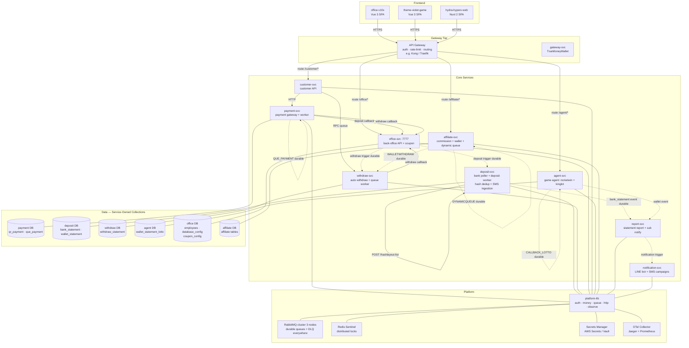
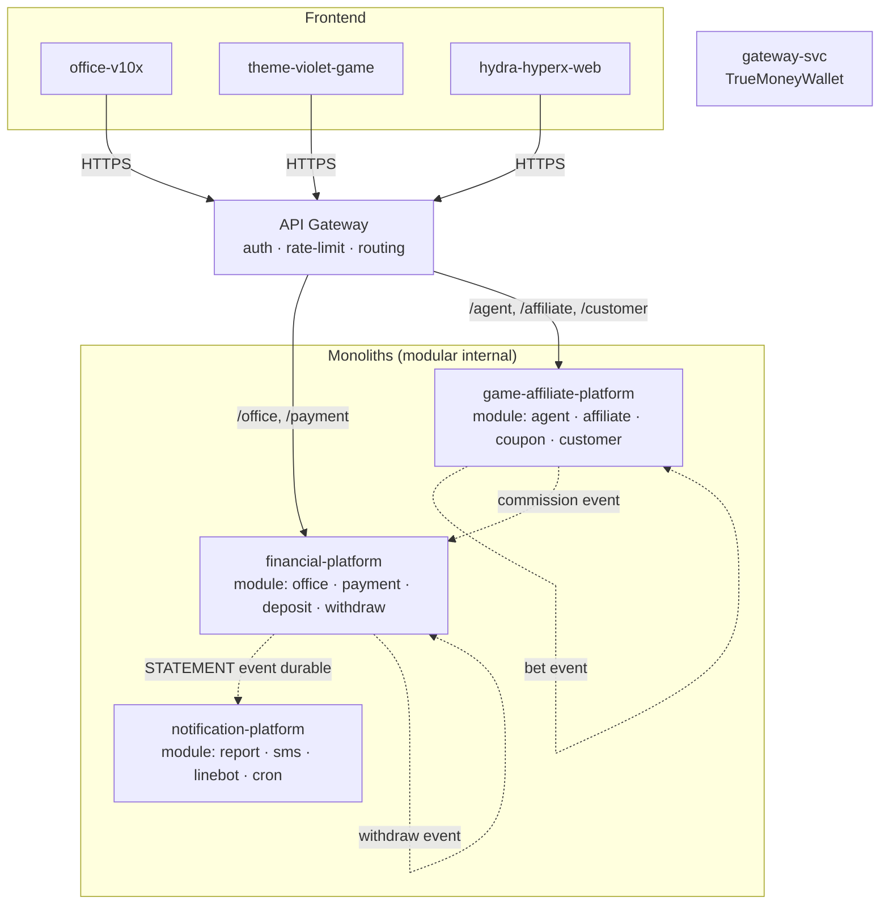

# Target Architecture Options

> วิเคราะห์ ณ commit: `40367af` · วันที่: 2026-06-15
> Constraints: fullstack 5 คน · ไม่มีทีม infra · design ต้องเสร็จสิ้น มิ.ย. 2026 · downtime OK · transformative

---

## ข้อสังเกตก่อนเลือก

ปัญหาที่ทุก option ต้องแก้ร่วมกัน (ไม่ใช่ architecture decision แต่เป็น prerequisite):
1. Rotate credentials ทันที (R-018, R-025) — ทำก่อนเริ่ม migration ใดๆ
2. เปลี่ยน durable=true + เพิ่ม DLQ ทุก financial queue — ทำได้เลยในโค้ดปัจจุบัน
3. ใส่ MongoDB transaction ใน queue-withdraw-go + pass context — patch ก่อน migrate

---

## Option 1 — Domain Service Consolidation (แนะนำ)

**แนวคิด:** ยุบ 25 repo → 10 deployables ตาม bounded context ที่ชัดเจน + สร้าง `platform-lib` Go module รวม auth/money/queue pattern ที่ fix ครั้งเดียวกระจายทุก service

### Target: 10 services + 3 SPAs + 1 shared lib

| # | Service | รวมจาก repo เดิม | เหตุผล |
|---|---------|----------------|--------|
| 1 | `payment-svc` | 3rd-payment + que_payment | เรียก API เดียวกัน, share qr_payment/withdraw_statement DB, 40+ provider packages ซ้ำ |
| 2 | `deposit-svc` | running-bank + go_deposit + hash-central + go_sms + SCHEDULE_SERVICE_BANK | pipeline เดียวกัน (ธนาคาร→dedup→credit), share bank_statement/wallet_statement |
| 3 | `withdraw-svc` | withdraw-auto + queue-withdraw-go | withdraw flow ต้องมี exactly-once — เจ้าของเดียวกัน |
| 4 | `affiliate-svc` | affiliate_standalone + hydra-affilaite + queue-dynamic-go | commission calculation + wallet เป็น domain เดียว |
| 5 | `agent-svc` | go-agent-rocketwin + kinglot-seamless (merged — ดูด้านล่าง) | share CALLBACK_LOTTO queue + wallet_statement_lotto collection |
| 6 | `office-svc` | office-api-v10 + coupon-service | office manages coupon lifecycle; coupon เป็น back-office domain |
| 7 | `report-svc` | go_report + sub_statement | consume STATEMENT fanout เหมือนกัน |
| 8 | `notification-svc` | go-linebot-system + cronjob-smsauto | outbound notification domain; ไม่มี financial state |
| 9 | `gateway-svc` | 3rd-gateway | ยังใช้งานอยู่ (confirmed); isolated (TrueMoneyWallet only); ไม่ share DB กับใคร → คงแยกไว้ ไม่รวมเข้า payment-svc |
| 10 | `customer-svc` | topupserie | API tier สำหรับ customer |
| — | `office-v10x` SPA | คงเดิม | rebuild เป็น proper SPA แยก env config |
| — | `theme-violet-game` SPA | คงเดิม | |
| — | `hydra-hyperx-web` SPA | คงเดิม | |
| — | **`platform-lib`** (Go module) | ใหม่ — shared | auth, money helper, queue helper, OTel |

### platform-lib รวม (ทำครั้งเดียว fix ทุก service)

```
platform-lib/
├── auth/          — JWT validate, service-to-service token, middleware
├── money/         — MongoDB transaction helper, idempotency key (UUID-based), distributed lock (Redis)
├── queue/         — channel factory (durable=true, DLQ), reconnect loop, DLQ handler
├── http/          — http.Client factory with timeout=30s default, OTel propagation
└── observe/       — OTel setup, structured log (zap), Prometheus metrics
```

### Target Diagram



> เส้นทึบ = sync HTTP | เส้นประ = async queue (durable) | แต่ละ service เป็นเจ้าของ collection ของตัวเอง

### ปัญหาที่แก้ได้จาก Phase 3

| ปัญหา Phase 4 | แก้อย่างไรใน Option 1 |
|---------------|----------------------|
| P-01: office hub | office-svc ยังมีแต่ตอนนี้รับแค่ admin operations; payment callbacks ไปที่ payment-svc โดยตรง |
| P-02: Non-durable queues | platform-lib/queue factory บังคับ durable=true + DLQ สำหรับทุก channel |
| P-03: Withdraw unsafe | withdraw-svc เจ้าของ withdraw_statement เดียว; platform-lib/money ให้ MongoDB transaction wrapper |
| P-04: Bet wallet unsafe | agent-svc เจ้าของ wallet_statement_lotto เดียว; unique index enforce ที่ platform-lib/money |
| P-05: Shared DB | แต่ละ service เป็นเจ้าของ collection; cross-service access ผ่าน API เท่านั้น |
| P-06: Credentials hardcoded | platform-lib/auth + Secrets Manager; env-only สำหรับทุก secret |
| P-07: Auth inconsistency | platform-lib/auth middleware เดียว ทุก service ใช้ |
| P-08: Code duplication | 40+ payment providers อยู่ใน payment-svc เดียว; agent code รวมใน agent-svc |
| P-09: Config SPOF | database_config → Secrets Manager + per-service env; ไม่ผ่าน collection เดียว |
| P-10: Frontend hardcoded | SPA rebuild ด้วย VITE_* env vars |
| P-11: Observability | platform-lib/observe OTel standard ทุก service |

### Trade-offs

| ข้อดี | ข้อเสีย |
|-------|---------|
| ทีม 5 คน ดูแล 10 service ได้ (2 service/คน) | ต้อง merge code จาก 25 repos — เวลาสูง |
| platform-lib แก้ครั้งเดียว propagate | lib versioning ต้องคุม semver; breaking change กระทบหลาย service |
| แต่ละ service scale แยกได้ (agent-svc บน game day) | ยังมีหลาย deployable → ops complexity ยังมี |
| DB ownership ชัด → schema migration controllable | migration data ที่ share อยู่ต้องทำ dual-write ช่วงย้าย |

---

## Option 2 — Three-Platform Monolith + API Gateway

**แนวคิด:** รวม 25 repo เป็น 3 monolith ตาม concern หลัก + API Gateway สำหรับ auth กลาง

| # | Monolith | รวมจาก repo เดิม |
|---|---------|----------------|
| 1 | `financial-platform` | office-api + payment + deposit + withdraw (workers embedded) |
| 2 | `game-affiliate-platform` | agent + affiliate + coupon + customer (topupserie) |
| 3 | `notification-platform` | go_report + sub_statement + go_sms + go-linebot-system + cronjob-smsauto |
| — | API Gateway | Kong / Traefik ด้านหน้า |
| — | 3 SPAs | คงเดิม |
| — | gateway-svc | คงเดิม |

### Target Diagram



### Trade-offs

| ข้อดี | ข้อเสีย |
|-------|---------|
| ง่ายต่อ ops — 3 deployable แทน 10 | แต่ละ monolith ใหญ่ — team conflict เมื่อ 5 คน push พร้อมกัน |
| Internal call = function call ไม่ใช่ network | ถ้าไม่คุม module boundary → big ball of mud ใน 1 ปี |
| ลด latency chain (sync เป็น in-process) | scale ไม่ได้แยกส่วน — ถ้า bet traffic ขึ้น ต้อง scale ทั้ง financial-platform |
| ง่ายต่อ atomic transaction ข้าม domain | deploy financial-platform พัง = ทุก flow money พัง (blast radius ใหญ่กว่า Option 1) |

---

## Agent Sub-Options (ใช้ได้กับทั้ง Option 1 และ 2)

### A2a — Merged agent-svc (แนะนำ)

รวม `go-agent-rocketwin` + `kinglot-seamless` เป็น binary เดียว แบ่ง package ภายใน:
```
agent-svc/
├── rocketwin/   — slot/game provider integration
├── kinglot/     — lotto provider integration  
├── wallet/      — shared wallet_statement_lotto operations (idempotency, transactions)
├── queue/       — CALLBACK_LOTTO_{SERVICE} consumer (one, not two)
└── _cmd/main.go — single entrypoint, SERVICE_TYPE env เลือก mode
```

**เหตุผลที่ควรรวม:**
- ทั้งสองดูด `CALLBACK_LOTTO_{SERVICE}` queue เดียวกัน — deploy พร้อมกัน = double-process
- share `wallet_statement_lotto` collection — ownership ต้องชัด ถ้าแยก = R-005/R-006 ยาก enforce
- IP allowlist logic identical — แก้ที่เดียว
- code ซ้ำ 80%+ (SKILL.md card confirms "nearly identical code")

### A2b — Separate with shared lib (ถ้าต้องการ deploy แยก)

ถ้าต้องการ scale rocketwin กับ kinglot แยกอิสระ (เช่น lotto traffic spike ต่างจาก slot):
```
agent-core/      — shared lib: wallet ops, CALLBACK consumer pattern, IP allowlist
rocketwin-svc/   — import agent-core, extend รองรับ slot/game provider
kinglot-svc/     — import agent-core, extend รองรับ lotto provider
```

ข้อควรระวัง: ต้องกำหนดชัดว่า `CALLBACK_LOTTO_{SERVICE}` ถูก consume โดยตัวใดตัวเดียว ไม่ใช่ทั้งคู่

---

## ตารางคะแนน (น้ำหนักตาม Architecture Drivers)

| Driver | Weight | Option 1 | Option 2 | เหตุผล |
|--------|--------|----------|----------|--------|
| D-01: เงินไม่หาย | 5 | **4** | **4** | ทั้งสองต้องใช้ platform-lib/money แก้ R-001/R-002 เหมือนกัน |
| D-02: ไม่ล่มจาก single failure | 4 | **4** | **3** | Option 2 monolith มี blast radius ใหญ่กว่า |
| D-03: Credential exposure | 5 | **5** | **5** | Secrets Manager ใช้ได้ทั้งคู่ |
| D-04: Security baseline | 5 | **4** | **4** | platform-lib/auth ใช้ได้ทั้งคู่ |
| D-05: Multi-tenant growth | 3 | **4** | **3** | Option 1 scale service แยกได้ตาม tenant load |
| D-06: Dev velocity (5 คน) | 4 | **4** | **3** | Option 1: ownership ชัดต่อ service; Option 2: team conflict ใน monolith ใหญ่ |
| D-07: Observability | 3 | **4** | **4** | ใช้ platform-lib/observe ได้ทั้งคู่ |
| **รวมถ่วงน้ำหนัก** | | **121** | **110** | |

### ทางเลือกที่แนะนำ: **Option 1 + A2a (Merged agent-svc)**

เหตุผล:
1. 5 คน ดูแล 10 service ทำได้จริง (2 service ต่อคน) — แต่ 3 monolith ขนาดใหญ่ทำให้ทุกคนต้องรู้ทุกอย่าง
2. Service boundary ตรงกับ data ownership ที่ต้องแก้ (P-05) — ทุก team member รู้ชัดว่า collection ไหน "ของใคร"
3. platform-lib ทำครั้งเดียว ใช้ 10 service — ROI สูงกว่า dup code fix ทีละ repo
4. agent-svc merged ตัดปัญหา R-005/R-006/R-037/R-038 ได้ clean กว่า (lock + idempotency enforce ที่ชั้นเดียว)
5. blast radius ต่อ failure เล็กกว่า Option 2 — ถ้า report-svc พัง ไม่กระทบ financial flow

**Option 1 ไม่เหมาะสำหรับกรณีไหน:** ถ้าทีมไม่มีประสบการณ์ maintain Go modules / versioning — ในกรณีนั้น Option 2 simpler ด้าน ops แต่ต้องลงทุน module discipline ภายใน monolith
