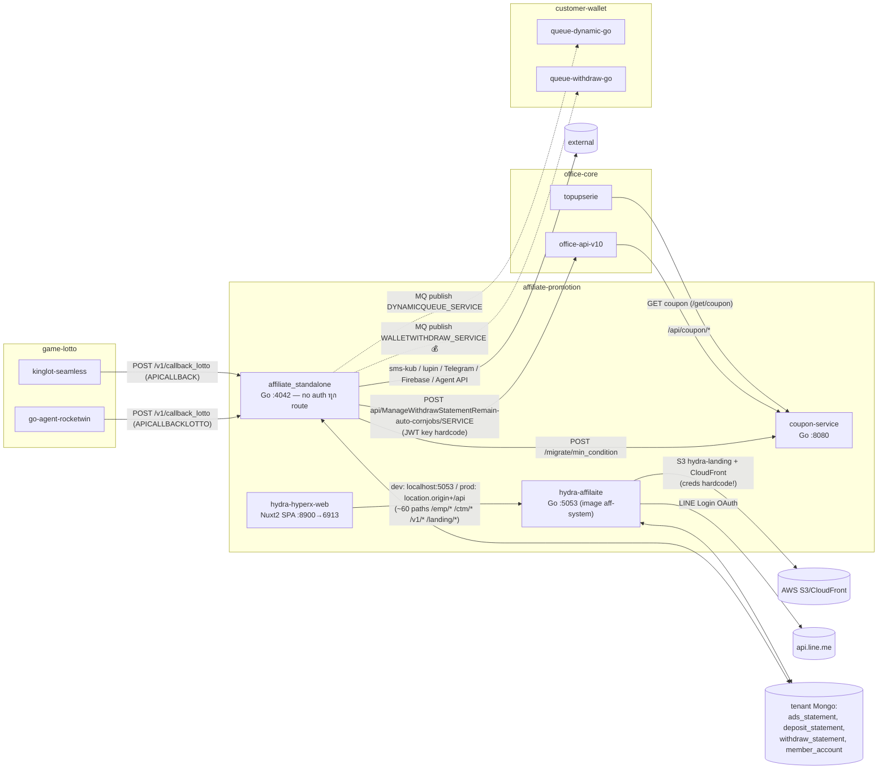
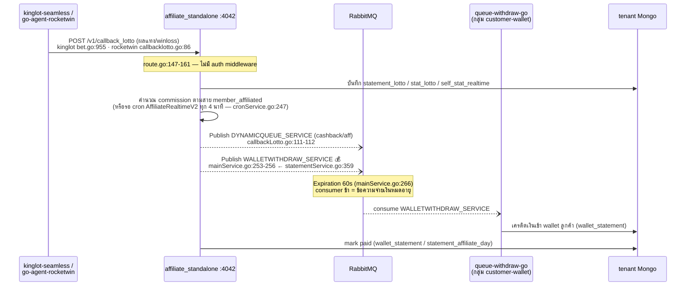

# กลุ่ม: affiliate-promotion

> วิเคราะห์: 2026-06-12 | commit: 40367af | [← กลับหน้าปก](README.md)

**สมาชิก:** `affiliate_standalone` (Go :4042) · `hydra-affilaite` (Go :5053 — ชื่อโฟลเดอร์สะกดผิดจาก "affiliate") · `hydra-hyperx-web` (Nuxt 2 SPA) · `coupon-service` (Go :8080)

---

## (ก) บทบาทของกลุ่ม

กลุ่มนี้คือ **เครื่องจักรหาลูกค้าและจ่ายผลตอบแทน** ของทั้งระบบ — ครอบคลุม 3 งานหลัก:

1. **Affiliate / Cashback engine** (`affiliate_standalone`) — รับ callback ผลเดิมพันจากระบบเกม/หวย, คำนวณค่าคอมมิชชั่นสายแนะนำ (member_affiliated) และ cashback, แล้ว **สั่งจ่ายเงินจริงเข้า wallet** ผ่าน RabbitMQ ไปยัง worker ของกลุ่ม [customer-wallet](customer-wallet.md) มี cron ~30 ตัวรันตลอดวัน (คำนวณ, จ่าย, reset ยอด)
2. **Campaign / Ads tracking** (`hydra-affilaite` + `hydra-hyperx-web`) — back-office สำหรับทีมการตลาด: สร้าง campaign/ads, สร้าง landing page ขึ้น AWS S3 + CloudFront, ติดตาม traffic_click → register → deposit ลง `ads_statement`, dashboard รายงาน และ re-stat ยอดย้อนหลัง
3. **Coupon** (`coupon-service`) — fan-in shared service: CRUD คูปอง + redeem ใช้โดย office-api-v10, topupserie และถูก migrate config โดย affiliate_standalone

**เงินไหลผ่านกลุ่มนี้จริง** ใน 4 เส้นทาง: (1) จ่าย affiliate commission / cashback → `WALLETWITHDRAW_<SERVICE>` → เครดิตเข้า wallet ลูกค้า, (2) `paid_cashback` / `pay_affilateufabet` / `clear_wallet_aff` ยิงผ่าน HTTP ได้ตรง ๆ, (3) coupon redeem = แจกโบนัสเป็นเงิน, (4) `re_withdraw` / `reset_statement` ของ hydra แก้ยอด withdraw/statement ย้อนหลังได้ — **และเกือบทั้งหมดไม่มี authentication** (ดู Risk Register)

จุดเชื่อมข้อมูลสำคัญ: `affiliate_standalone` และ `hydra-affilaite` **เขียน collection เดียวกันใน tenant DB** (`ads_statement`, `deposit_statement`, `withdraw_statement`, `member_account`, `self_stat*`, `campaign`) ซึ่งเป็น DB เดียวกับโดเมน [office-core](office-core.md)/topupserie — coupling ผ่าน database ไม่ใช่ API

---

## (ข) แผนผังกลุ่ม

### Sequence: "จ่าย affiliate commission" (เส้นเงินหลักของกลุ่ม)

---

## (ค) ตาราง Edge (ยืนยันสองฝั่ง)

| # | from | to | ชนิด | ชื่อจริง (path/queue) | หลักฐานฝั่งต้นทาง | หลักฐานฝั่งปลายทาง | conf |
|---|------|----|------|----------------------|--------------------|----------------------|------|
| 1 | hydra-hyperx-web | hydra-affilaite | HTTP (base URL) | dev `http://localhost:5053`; prod `location.origin+/api`; ~60 paths `/emp/*` `/ctm/*` `/v1/*` `/landing/*` | hydra-hyperx-web/plugins/axios.js:1-11; plugins/controller/emp.js, ctm.js, v1.js, summary.js | hydra-affilaite/server.go:32 (`:5053`); route.go:12-176 path ตรงกัน | 🟢 |
| 2 | affiliate_standalone | coupon-service | HTTP | `POST /migrate/min_condition` (env `COUPON_SERVICE`) | affiliate_standalone/controller/migrateCoupon.go:31,44 | coupon-service/internal/route/router.go:68 | 🟢 |
| 3 | affiliate_standalone | office-api-v10 ([office-core](office-core.md)) | HTTP 💰 | `POST api/ManageWithdrawStatementRemain-auto-cornjobs/<SERVICE>` (ยกยอดถอนข้ามวัน) — sign JWT HS256 ด้วย secret hardcode `2ac714e8d1451244432013c2d7aa2fd7` | affiliate_standalone/service/affiliateRealtimeV2.go:1200-1213 | office-api-v10 auth.go:617-620 (secret เดียวกัน) | 🟢 |
| 4 | affiliate_standalone | queue-dynamic-go ([customer-wallet](customer-wallet.md)) | MQ publish | queue `DYNAMICQUEUE_<SERVICE>` payload `model.SendDataQueue` (Types: COVIDAFFILIATE / AFFILIATE_LOTTO / HYDRA_UFA_AFFILIATE ฯลฯ) | affiliate_standalone/controller/callbackLotto.go:111-112; service/affiliateRealtimeV2.go:571,664,758,793,880,2725; covidService.go:97 | queue-dynamic-go consumer handle Types ดังกล่าว | 🟢 |
| 5 | affiliate_standalone | queue-withdraw-go ([customer-wallet](customer-wallet.md)) | MQ publish 💰 | queue `WALLETWITHDRAW_<SERVICE>` (routingKey "EVENTACTION" ถูก map เป็นชื่อนี้) | affiliate_standalone/service/mainService.go:253-256 ← statementService.go:359 | queue-withdraw-go consumer | 🟢 |
| 6 | go-agent-rocketwin ([game-lotto](game-lotto.md)) | affiliate_standalone | HTTP (IN) | `POST /v1/callback_lotto` (env `APICALLBACKLOTTO`) | go-agent-rocketwin callbacklotto.go:86 | affiliate_standalone/route.go:147-161 | 🟢 |
| 7 | kinglot-seamless ([game-lotto](game-lotto.md)) | affiliate_standalone | HTTP (IN) | `POST /v1/callback_lotto` (env `APICALLBACK`) | kinglot-seamless bet.go:955 | affiliate_standalone/route.go:147-161 | 🟢 |
| 8 | office-api-v10 ([office-core](office-core.md)) | coupon-service | HTTP (IN) | `/api/coupon/*` (CRUD คูปอง) | office-api-v10 ฝั่งเรียก coupon | coupon-service/internal/route/router.go:25-32 | 🟢 |
| 9 | topupserie ([office-core](office-core.md)) | coupon-service | HTTP (IN) | ดึงคูปอง (`/get/coupon` ฝั่ง topupserie → `GET /api/coupon/*`) | topupserie ฝั่งเรียก | coupon-service/internal/route/router.go:25-29 | 🟢 |
| 10 | affiliate_standalone + hydra-affilaite | tenant Mongo (shared) | DB R/W | `ads_statement`, `deposit_statement`, `withdraw_statement`, `member_account`, `self_stat(_realtime)`, `campaign` — DB เดียวกับโดเมน office/topupserie | affiliate_standalone card §data (37-50 call sites/collection) | hydra-affilaite prefix.go:455-518; restat.go:419-1671; dashboard.go:7933-7988 | 🟢 |
| 11 | hydra-affilaite | AWS S3 `hydra-landing` + CloudFront | external | PutObject/ListObjects, create/delete distribution | hydra-affilaite/awsService.go:20-175,327,487; mainService.go:474-483 | — (external) | 🟢 |
| 12 | hydra-affilaite | LINE Login (api.line.me) | external | `/oauth2/v2.1/token`, `/v2/profile` | hydra-affilaite/loginService.go:144-223 | — (external) | 🟢 |
| 13 | affiliate_standalone | sms-kub / lupin / Telegram / Firebase / Agent API | external | `console.sms-kub.com/api/campaigns`, `sendsms.lupin.host/api/create_sms_log`, Telegram Bot, Firebase RTDB, `SERVICE_API` | ticketService.go:998,1017; helper.go:215; agentService.go:44-125 | — (external) | 🟢 |
| 14 | hydra-affilaite | เว็บ tenant (`SystemURL` จาก `database_config`) | HTTP runtime | `/api/prefix_v2`, `/api/game/category_game`, `/api/bank_code_list` | hydra-affilaite/prefix.go:443,596,625 | ปลายทางเป็น tenant runtime — ระบุ repo ไม่ได้ | 🟡 |

> ⚠️ หมายเหตุ boundary: **business logic ของ affiliate (Types COVIDAFFILIATE / AFFILIATE_LOTTO / HYDRA_UFA_AFFILIATE) ถูกประมวลผลจริงใน `queue-dynamic-go` ซึ่งอยู่กลุ่ม [customer-wallet](customer-wallet.md)** — แก้สูตรจ่าย affiliate ต้องแก้ 2 กลุ่ม repo พร้อมกัน

---

## (ง) Key Flows

### Flow 1 — lotto callback → cashback/commission → เงินเข้า wallet

1. ลูกค้าแทงหวย/มินิเกม → ระบบเกม ([game-lotto](game-lotto.md)) settle ผล แล้วยิง `POST /v1/callback_lotto` มาที่ affiliate_standalone (kinglot-seamless bet.go:955, go-agent-rocketwin callbacklotto.go:86)
2. affiliate_standalone รับโดย **ไม่มี auth** (route.go:147-161) → บันทึก `statement_lotto` / `stat_lotto` / `self_stat_realtime` แล้วคำนวณค่าคอมตามสาย `member_affiliated`
3. publish `DYNAMICQUEUE_<SERVICE>` (callbackLotto.go:111-112) สำหรับ cashback/affiliate types — consumer คือ `queue-dynamic-go` (กลุ่ม customer-wallet)
4. เส้นจ่ายตรง: statementService.go:359 → mainService.go:253-256 publish `WALLETWITHDRAW_<SERVICE>` → `queue-withdraw-go` เครดิตเงินเข้า wallet (`wallet_statement`)
5. cron กวาดซ้ำ: `AffiliateRealtimeV2` ทุก 4 นาที (cronService.go:247), `HandlePayToWallet` 00:30 / `PayToWalletV2` 01:15 (cronService.go:259-260), `HandleResetCashback` 00:10 (cronService.go:271) — ทุกตัวจ่าย/รีเซ็ตเงินอัตโนมัติ
6. สิ้นวัน: `autoCarryNextDay` 00:00:01 ยิง `POST api/ManageWithdrawStatementRemain-auto-cornjobs/<SERVICE>` ไป office-api-v10 ด้วย JWT secret hardcode (affiliateRealtimeV2.go:1200-1213) เพื่อยกยอดถอนค้างข้ามวัน

### Flow 2 — coupon redeem

1. ผู้เรียก (office-api-v10 / topupserie / **ใครก็ได้ เพราะไม่มี auth**) ยิง `POST /api/redeem/` ด้วย service+couponID+code+username (router.go:44, redeem/handler.go:69)
2. lookup coupon: Redis cache `code-<service>-<code>` TTL 2h เฉพาะ MANYTIME (redeem/repo.go:22,38) → fallback Mongo `coupon_config`
3. `checkRedeemCouponConfig` เช็ค `$expr: {$lt: ["$receive","$limit"]}` (redeem/service.go:131-152) — **query เช็คแยกจาก query update ไม่ atomic**
4. `createRedeemCouponStatement` insert `coupon_statement` (service.go:191) — กันซ้ำพึ่ง unique index `hash_unique` (username+couponID) ที่นิยามใน index.go:40-41,66 แต่ **`repo.InitCollection` ถูก comment ใน router.go:21** → index ไม่ถูกสร้างอัตโนมัติ
5. `updateRedeemCouponConfig` `$inc receive` (service.go:222) — ถ้า step 4 สำเร็จแต่ step 5 ล้ม counter ไม่ตรง (ไม่มี transaction — service.go:56-69)
6. ผู้เรียก (office/topupserie) เป็นคนเครดิตโบนัสเข้ากระเป๋าตาม statement ที่ redeem สำเร็จ

### Flow 3 — campaign tracking (ads_statement)

1. ทีมการตลาด login hydra-hyperx-web (LINE Login หรือ username — nuxt.config.js:112-197) → สร้าง campaign/ads ผ่าน `/emp/create_campaign`, `/emp/create_ads_batch` (สูงสุด 20k/req — hydra route.go:83)
2. hydra-affilaite สร้าง landing page จาก template → อัปโหลด S3 `hydra-landing` + สร้าง CloudFront distribution (awsService.go, creds hardcode mainService.go:478-479)
3. ลูกค้าเข้า landing → `GET /landing/prefix/:service?hid=...` → hydra `$inc traffic_click` ใน `campaign` + upsert `ads_statement` (prefix.go:455,483,510,518) แล้ว redirect ไปเว็บ tenant (`SystemURL` จาก `database_config` — prefix.go:429,443)
4. ลูกค้าสมัคร/ฝากเงินบนเว็บ tenant → `deposit_statement`/`member_account` ถูกเขียนโดยระบบ office — hydra และ affiliate_standalone อ่าน collection เดียวกันนี้มาคิดยอดต่อ ads (restat.go, dashboard.go)
5. re-stat ย้อนหลัง: `POST /emp/re_hydra_statement` → archive `ads_statement` → `ads_statement_delete` แล้ว **ลบทิ้งก่อนคำนวณใหม่** (restat.go:254-261) → `$inc` upsert ทีละ self_stat record (restat.go:1600-1672) แบบ async หลาย goroutine ไม่มี lock

---

## (จ) Risk Register

### หมวด 1 — Authentication / การเข้าถึง endpoint การเงิน

| # | ความเสี่ยง | ระดับ | file:line | ผลกระทบ | ข้อเสนอ |
|---|-----------|-------|-----------|---------|---------|
| 1.1 | **ทุก ~40 route ของ affiliate_standalone ไม่มี auth middleware เลย** รวม endpoint จ่ายเงิน: `/v1/paid_cashback`, `/v1/pay_cashback_realtime`, `/v1/clear_wallet_aff`, `/v1/pay_affilateufabet`, `/v1/aff_manual`, `/test/create_deposit`, `/test/covid/reset_credit`, `/test/affiliate_cal(_all)/manual` | 🔴 | affiliate_standalone/route.go:88-140 (group /v1 :70, /test :126; ไม่มี `r.Use` auth, CORS comment server.go:27) | ใครเข้าถึง network ได้ = สั่งจ่าย cashback/เคลียร์ wallet/สร้าง deposit ปลอม/reset credit ได้ทันที | ใส่ JWT/mTLS หรืออย่างน้อย service-key middleware ทั้ง router; ถอด `/test/*` ออกจาก production build |
| 1.2 | hydra-affilaite endpoint แก้ยอดเงินไม่มี auth: `POST /v1/re_withdraw`, `GET /v1/get_withdraw`, `POST /v1/reset_statement(_campaign)`, `/emp/member_affiliate`, `/emp/member_statement_affiliate` — แก้ withdraw_statement (mark is_recal) + ลบ/คำนวณ ads_statement ใหม่ได้โดยไม่ login (กันแค่ optional header `Key` ถ้า env `SERVICE_ADS` set) | 🔴 | hydra-affilaite/route.go:33-38,59-60; dashboard.go:7933-7988; restat.go:16,49; dashboard.go:2266 | บุคคลภายนอกแก้ยอดถอน/ล้าง statistic affiliate ทั้ง campaign — เปลี่ยนยอดจ่าย commission ได้ | ย้ายเข้า group AuthJWT + บังคับ `Key` เสมอ (ไม่ optional) |
| 1.3 | coupon-service: `POST /api/redeem/` ใช้คูปองจริงโดยไม่มี auth (รู้แค่ service+code+username) และ `DELETE /api/redis/flushall` + `DELETE /redis/:redisKey` (hydra route.go:167) ล้าง cache ได้จาก HTTP เปล่า ๆ | 🔴 | coupon-service/internal/route/router.go:44,49-51; redeem/handler.go:69; hydra-affilaite/route.go:167-168 | redeem คูปองแทนผู้อื่น/กวาดคูปองหมดโควต้า; flushall = DoS + cache poisoning | service token ระหว่าง office↔coupon; ปิด redis admin endpoint หรือจำกัด network policy |
| 1.4 | IP allowlist ของ coupon `/api/access` bypass ได้: เทียบ `client != "0.0.0.0"` และ `c.ClientIP()` เชื่อ `X-Forwarded-For` → ปลอม header ผ่านได้ | 🟠 | coupon-service/internal/middleware/access_ip.go:20-21 | ข้าม IP check เข้าจัดการ access list ได้ | ใช้ trusted proxy config ของ Gin + ตัด sentinel `0.0.0.0` |
| 1.5 | hydra `AuthJWT`: group==5 ผ่านทุก route ทันที, `claims["group"].(float64)` ไม่เช็ค ok → panic ได้, JWT secret fallback เป็น string `"secret"` ถ้า env `SECRET` ว่าง (token อายุ 48 ชม.) | 🔴 | hydra-affilaite/authJWT.go:27-28,41-44,59 | ถ้า env ตกหล่น = forge token ได้ทุกสิทธิ์; claim ผิดรูป = service crash | บังคับ fail-fast ถ้า SECRET ว่าง; type-assert แบบ safe; ทบทวนตรรกะ group |

### หมวด 2 — ความถูกต้องของเงิน/ข้อมูล (atomicity & idempotency)

| # | ความเสี่ยง | ระดับ | file:line | ผลกระทบ | ข้อเสนอ |
|---|-----------|-------|-----------|---------|---------|
| 2.1 | **coupon double-redeem**: unique index `hash_unique` นิยามไว้แต่ `InitCollection` ถูก comment — ไม่ถูกสร้างอัตโนมัติ; check-limit กับ update เป็น 2 query แยก (check → insert statement → `$inc receive`) ไม่ atomic, ไม่มี transaction; redis queue/SetNX ที่ตั้งใจกัน concurrency เป็น dead code (`CreateRedeem` เรียกตรง) | 🔴 | coupon-service/service/repo/index.go:40-41,66 vs internal/route/router.go:21; redeem/service.go:56-69,131-152,198-225; redeem/service.go:77-147 + handler.go:93 | ยิง redeem พร้อมกัน = ใช้คูปองซ้ำ/เกิน limit → เงินโบนัสรั่ว | un-comment `InitCollection` (หรือสร้าง index ใน migration); รวม check+inc เป็น `FindOneAndUpdate` เงื่อนไขเดียว |
| 2.2 | hydra re-stat **ลบก่อนคำนวณ ไม่ atomic**: archive→`DeleteManyStatement` แล้วค่อย rebuild; `$inc` upsert ไม่มี idempotency key; รัน `go hydraReStat` async ไม่มี lock กันรันซ้อน → รันซ้ำ/ตายกลางทาง = double-count หรือข้อมูลหาย | 🔴 | hydra-affilaite/restat.go:254-261 (delete), 1600-1672 ($inc), restat.go:45,79 (go async) | ยอด ads_statement (ฐานคิดค่าคอม) เพี้ยน — จ่ายเกิน/ขาด | ทำ re-stat ลง collection ใหม่แล้ว swap; ใส่ distributed lock + job status |
| 2.3 | MQ message จ่ายเงินมี `Expiration: "60000"` (60s) — consumer ช้า/ตาย = ข้อความ `WALLETWITHDRAW_<SERVICE>` หมดอายุเงียบ ๆ → จ่ายไม่ครบโดยไม่มี error | 🟠 | affiliate_standalone/service/mainService.go:266 | เงินที่ควรเข้ากระเป๋าหายเงียบ; reconcile ยาก | ตัด TTL ออกสำหรับ queue การเงิน + ใส่ DLX |
| 2.4 | งานลบ/แก้ข้อมูลรันทันทีตอน boot: `DeleteStatementAffiliateDay`, `HandleUpdateSelfStat`, `WalletValidation`, `TicketMigrate` synchronous ใน `Route()`; `AgentResetCreditZero` ตอน StartServer | 🟠 | affiliate_standalone/route.go:33-44; server.go:48 | restart หลาย replica = งานแก้ข้อมูลรันซ้ำพร้อมกัน + boot ช้า/block | ย้ายเป็น migration/cron เดียวมี lock |
| 2.5 | redeem statement สร้างแล้วแต่ `$inc receive` ล้ม → counter ไม่ตรงกับ statement (ไม่มี rollback) | 🟡 | coupon-service/redeem/service.go:56-69 | ยอด receive ต่ำกว่าจริง → แจกเกิน limit | รวมใน transaction หรือกลับลำดับ + compensate |

### หมวด 3 — Secrets / Credentials ในซอร์สโค้ด

| # | ความเสี่ยง | ระดับ | file:line | ผลกระทบ | ข้อเสนอ |
|---|-----------|-------|-----------|---------|---------|
| 3.1 | **AWS AccessKey/Secret hardcode** ใน `GetStaticAWS()` (`AKIA5MF2WON2...`) — บรรทัดอ่านจาก env ถูก comment; ใช้คุม S3 `hydra-landing` + CloudFront ทุก landing page; `/external/create_cloudfront` (no auth) ยังรับ AccessKey/Secret จาก request body | 🔴 | hydra-affilaite/mainService.go:478-479 (env ที่ comment :481); awsService.go:327-330; route.go:174-175 | คีย์ AWS จริงรั่วกับทุกคนที่เห็น repo — ยึด/ลบ landing ทั้งหมด, สร้างค่าใช้จ่าย | revoke key ทันที, ย้ายเป็น IAM role/env, ปิด external endpoint |
| 3.2 | **JWT secret ข้าม service hardcode**: key `147ce3cba2...` + secret `2ac714e8d1451244432013c2d7aa2fd7` ใช้ sign token เรียก endpoint ถอนเงินของ office-api-v10 (ฝั่ง office ใช้ secret เดียวกัน auth.go:617-620) — secret อยู่ในซอร์สทั้งสองฝั่ง | 🔴 | affiliate_standalone/service/affiliateRealtimeV2.go:1200-1203,1212-1213 | ใครเห็นซอร์ส = forge token (exp 5 นาที ต่ออายุเองได้) สั่งจัดการ withdraw statement ที่ office | ย้ายเป็น env/secret manager + rotate ทั้งสองฝั่ง |
| 3.3 | superadmin seed ทุก boot: `CreateDefault` สร้าง account จาก `static/model/account_office.json` (ฝัง line_user_id / key_register=เบอร์โทร / role level 30, password ว่างบางราย) ทุกครั้งที่ service start | 🔴 | hydra-affilaite/demo.go:132,275; static/model/account_office.json (เช่นบรรทัด 494) | ผู้รู้ key_register/line_user_id สวมสิทธิ์ superadmin ได้ ลบแล้วก็ revive ตอน restart | ตัด seed ออกจาก boot path; hash/secret ต่อ environment |
| 3.4 | credentials อื่น hardcode: Redis `default/redispw` (hydra); Bearer JWT ของ user จริง (มี PII: ชื่อ/เบอร์/บัญชีธนาคารใน payload) ค้างในคอมเมนต์ helper ของ affiliate; URL agent `pussy888fun.api-node.com` ฯลฯ เลือกด้วย `rand.Intn` | 🟠 | hydra-affilaite/redisService.go:72-73; affiliate_standalone/helper/helper.go:95; agentService.go:118-130 | PII รั่ว + config ฝังโค้ด แก้ per-env ไม่ได้ | ลบคอมเมนต์/rotate; ย้าย URL เข้า config |

### หมวด 4 — ความเสถียร (panic / timeout / retry)

| # | ความเสี่ยง | ระดับ | file:line | ผลกระทบ | ข้อเสนอ |
|---|-----------|-------|-----------|---------|---------|
| 4.1 | `panic(err)` เมื่อ outbound HTTP ล้มเหลว: affiliate `HttpHandle` POST + `CallAPIALL`; hydra `HttpHandle` เช่นกัน — ปลายทางล่ม = ทั้ง service panic กลาง cron จ่ายเงิน | 🔴 | affiliate_standalone/service/mainService.go:142-153; ticketService.go:1035; hydra-affilaite/mainService.go:105 | จ่ายเงินค้างครึ่งทาง (ดูคู่กับ 2.2/2.3); service restart loop | return error + retry/circuit breaker |
| 4.2 | HTTP client ไม่มี timeout เกือบทุกตัว (`&http.Client{}`): `CallAPI`, `HttpHandle`, `CallAPIALL`, hydra `CALLHttpExternal` (LINE OAuth ด้วย) — มีแค่ agentService ที่ตั้ง 10s | 🟠 | affiliate_standalone/helper/helper.go:79-80; mainService.go:146; ticketService.go:1034; hydra-affilaite/mainService.go:84,135 | goroutine ค้างสะสมเมื่อปลายทางหน่วง → memory/connection leak | ตั้ง timeout มาตรฐาน + context |
| 4.3 | `CreateMQ` retry loop ไม่มีขอบเขต (`maxRetry` นับขึ้นอย่างเดียว) — RabbitMQ ตาย = วน infinite; และ error จาก `CreateResource`/`CreateMQ` ตอน boot แค่ `fmt.Println` แล้วไปต่อ (resource อาจ nil); coupon-service boot fail แค่ sleep 5s แล้ว return เงียบ | 🟠 | affiliate_standalone/_config/mq.go:16; server.go:31-35; coupon-service/server.go:35-37 | start แบบครึ่ง ๆ กลาง ๆ / ตายเงียบไม่มี alert | fail-fast + healthcheck/readiness probe |
| 4.4 | port config ไม่ตรง: hydra ฟัง `:5053` แต่ docker-compose map `5052:5052`; affiliate hardcode `:4042` ไม่อ่าน env | 🟡 | hydra-affilaite/server.go:32 vs docker-compose.yml:11; affiliate_standalone/server.go:64 | deploy แล้วเข้าไม่ถึง / ชน port | อ่าน PORT จาก env ให้ตรง convention กลุ่ม |

### หมวด 5 — Client-side & ขอบเขตระบบ

| # | ความเสี่ยง | ระดับ | file:line | ผลกระทบ | ข้อเสนอ |
|---|-----------|-------|-----------|---------|---------|
| 5.1 | hydra-hyperx-web เก็บ JWT ใน localStorage/cookie ผ่าน auth-next (ไม่ปิด localStorage) + ทุก request แนบ `Authorization` — XSS ใด ๆ อ่าน token พนักงาน (อายุ 48 ชม.) ได้ | 🟠 | hydra-hyperx-web/nuxt.config.js:101-198; plugins/auth.js:22-39; plugins/axios.js:13-26 | ยึด session back-office การตลาด → ใช้ต่อยอดเรียก endpoint การเงิน hydra | httpOnly cookie ฝั่ง proxy; ลด token TTL |
| 5.2 | CORS `*` ทั้ง hydra และ coupon รวม endpoint การเงินที่ไม่ auth; `/v1/upload_demo` ใช้ mock user ฝังโค้ด (group 3 level 30) อัปโหลดไฟล์ขึ้น S3 ได้โดยไม่ login | 🟠 | hydra-affilaite/server.go:38-41; mainService.go:225-233 + demo.go:48; coupon-service/server.go:50,88-92 | ขยายพื้นโจมตีของข้อ 1.2/1.3; ฝากไฟล์แปลกปลอมบน CDN landing | จำกัด origin; ปิด demo endpoint |
| 5.3 | business logic affiliate กระจายข้ามกลุ่ม: ตัวคำนวณอยู่ที่นี่ แต่ตัวจ่ายจริง (Types COVIDAFFILIATE/AFFILIATE_LOTTO/HYDRA_UFA_AFFILIATE) อยู่ใน queue-dynamic-go (customer-wallet); ads_statement/deposit_statement แชร์ DB กับ office — ไม่มี API boundary | 🟡 | affiliate_standalone card §publish; hydra card §data; [customer-wallet](customer-wallet.md) | แก้สูตรจ่ายต้อง sync 2-3 repo; schema drift เงียบ | นิยาม owner ต่อ collection + contract test ตอน rewrite |

### ✅ ตรวจแล้วผ่าน

- **กันเกิน limit คูปองระดับ DB (บางส่วน)** — `updateRedeemCouponConfig` ใช้ filter `$expr: {$lt: ["$receive","$limit"]}` ใน query update เอง ทำให้ `$inc` ไม่ทะลุ limit ที่ระดับ single update (coupon-service/redeem/service.go:198-225) — ช่องโหว่เหลือเฉพาะ gap ระหว่าง insert statement กับ update (ข้อ 2.1)
- **โครง unique index ออกแบบถูก** — `hash_unique` บน `coupon_statement.hash` (username+couponID) กัน double-redeem ได้จริง **ถ้าถูกสร้างใน DB** (index.go:40-41,66)
- **Redis cache คูปองมี TTL จำกัด** — key `code-<service>-<code>` TTL 2h และจำกัดเฉพาะ type MANYTIME, key ผูก service จึงไม่ชนข้าม tenant (redeem/repo.go:22,38)
- **เส้นเรียก office มี exp สั้น** — JWT ที่ affiliate ใช้เรียก office หมดอายุใน 5 นาที (affiliateRealtimeV2.go:1212) — ลดความเสียหายจาก token รั่ว (แต่ secret รั่วก็สร้างใหม่ได้ — ข้อ 3.2)
- **agentService มี timeout** — เฉพาะ outbound ไป game agent ตั้ง timeout 10s (agentService.go:40,72) ต่างจาก client อื่นที่ไม่มี

### ❓ ข้อสงสัย (ยังไม่ยืนยัน)

- **index `hash_unique` มีอยู่จริงใน prod DB หรือไม่** — repo บอกได้แค่ว่าโค้ดสร้าง index ถูก comment (router.go:21); ถ้าเคยรันก่อน comment หรือสร้าง manual ไว้ ความเสี่ยง 2.1 จะลดลงมาก — ต้องตรวจ `db.coupon_statement.getIndexes()` ใน prod
- **queue-dynamic-go / queue-withdraw-go bind queue ชื่อ `<SERVICE>` ครบทุก tenant หรือไม่** — ชื่อ queue ต่อ tenant runtime; ถ้า tenant ใดไม่มี consumer ข้อความจ่ายเงินจะหมดอายุใน 60s เงียบ ๆ (ข้อ 2.3) — ตรวจจาก RabbitMQ management จริง
- **office-api-v10 ฝั่งรับ validate อะไรเพิ่มนอกจาก JWT secret ร่วม** (auth.go:617-620) — เช่น IP allowlist — มีผลต่อความรุนแรงข้อ 3.2
- **header `Key`/`SERVICE_ADS` ถูก set ใน env prod ของ hydra หรือไม่** — ถ้า set, endpoint dashboard บางตัว (dashboard.go:2266,2313) มี guard ขั้นต่ำ; ถ้าไม่ = เปิดโล่งตามข้อ 1.2

---

## (ฉ) Unknown / นอกขอบเขต repo

| ประเด็น | สิ่งที่รู้ | สิ่งที่ไม่รู้ |
|---------|----------|--------------|
| Reverse proxy `/api` ของ hydra-hyperx-web | prod base URL = `location.origin + '/api'` (plugins/axios.js:4) แต่ Dockerfile เสิร์ฟ static ด้วย `http-server` ล้วน (Dockerfile:23) — ไม่มี nginx config ใน repo | proxy ตัวจริงอยู่ที่ infra/ingress นอก repo — ใครเป็นคน strip `/api` และมี auth/TLS อะไรคั่นหรือไม่ |
| `aff-system.warmlight.online` | ปรากฏเป็น comment ใน plugins/axios.js:2 และเป็น env `baseURL` ใน docker-compose.yml:10 / env.txt:1 — แต่โค้ดไม่อ่าน env นี้ (nuxt-env ถูก comment, nuxt.config.js:78-96) = dead config | โดเมนนี้ยังเป็น deployment จริงอยู่หรือไม่ |
| tenant `SystemURL` runtime | hydra ดึงรายชื่อ tenant + `system_url` จาก collection `database_config` ตอน runtime (prefix.go:429,443; _config/db.go:64) | จำนวน/รายชื่อ tenant จริงและ repo ปลายทางของแต่ละ SystemURL — ระบุจาก static analysis ไม่ได้ |
| consumer ของ `DYNAMICQUEUE_<SERVICE>` ครบทุก Type หรือไม่ | queue-dynamic-go handle COVIDAFFILIATE / AFFILIATE_LOTTO / HYDRA_UFA_AFFILIATE (ดู [customer-wallet](customer-wallet.md)) | Types อื่นที่ affiliate publish (จาก call sites 8 จุด) มี handler ครบหรือ drop เงียบ |
| `topupserie → /get/coupon` | edge ยืนยันแล้วว่า topupserie เรียก coupon-service | mapping path ฝั่ง topupserie (`/get/coupon`) ลง route ไหนของ coupon (`GET /api/coupon/` หรือ `/api/coupon/code/:id`) — ดูรายละเอียดที่ [office-core](office-core.md) |

---

**กลุ่มข้างเคียง:** [office-core](office-core.md) · [customer-wallet](customer-wallet.md) · [game-lotto](game-lotto.md)
