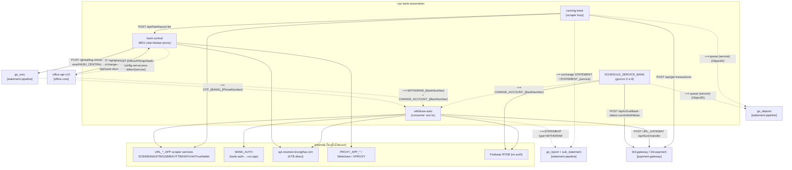
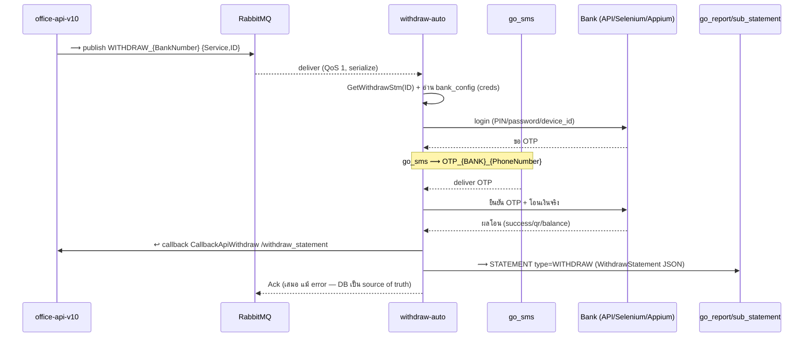
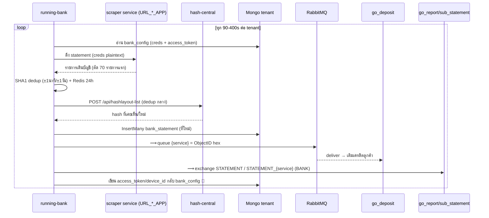

# กลุ่ม: bank-automation

> วิเคราะห์: 2026-06-12 | commit: 40367af | [← กลับหน้าปก](README.md)

สมาชิก: **running-bank** · **withdraw-auto** · **SCHEDULE_SERVICE_BANK** · **hash-central**
ดูกลุ่มที่เกี่ยวข้อง: [office-core](office-core.md) · [payment-gateway](payment-gateway.md) · [statement-pipeline](statement-pipeline.md)

---

## (ก) บทบาทของกลุ่ม

กลุ่มนี้คือ **"มือที่จับเงินจริงในบัญชีธนาคารจริง"** — เป็นกลุ่มที่ความเสี่ยงสูงสุดของทั้งระบบ เพราะทุก service ในนี้ถือ credential จริงของบัญชีธนาคาร (username/password/PIN/citizen_id/access_token/device_id) และสามารถ **ดึงเงินเข้า** (อ่าน statement → เติมเครดิตลูกค้า) และ **โอนเงินออก** (ถอน/โยกเงินจริง) ได้โดยอัตโนมัติ ไม่มี human-in-the-loop ในเส้นทางหลัก หาก service ใด service หนึ่งทำงานผิด (โอนซ้ำ, dedup ชน, ตัดสินใจจาก balance ปลอม) = เงินจริงหาย/รั่วทันที

| สมาชิก | บทบาท | รูปแบบ |
|---|---|---|
| **running-bank** | scraper loop ดึง bank statement ทุก tenant → dedup (SHA1 + Redis + hash-central) → insert `bank_statement` → publish RabbitMQ ให้ go_deposit เติมเครดิต | Go worker (ไม่มี HTTP), infinite poll + sleep สุ่ม 90-400s ตาม BANK_CODE |
| **withdraw-auto** | consumer ถอนเงินจริง — รับ `WITHDRAW_{bank}` / `CHANGE_ACCOUNT_{bank}` แล้วโอนออกผ่าน Bank API / Selenium netbank / Appium mobile; รับ OTP จาก SMS gateway มาใช้ login | Go worker (consumer ล้วน), QueueManager/BankWorker, QoS(1) serialize |
| **SCHEDULE_SERVICE_BANK** | gocron ทุก 3 นาที — SCB-Business transfer (create→confirm→verify), recreate credit, สร้างรายการโยกบัญชี (`CHANGE_ACCOUNT_`), callback สถานะถอน, noti limit/ban | Go gocron scheduler (ไม่มี HTTP) |
| **hash-central** | บริการกลาง port 8001 — slip-verify (KTB reverse-engineered / slip2go / EasySlip) + dedup hash กลาง + proxy pool manager + bot device-gen | Go/Gin REST (เพียงตัวเดียวในกลุ่มที่เปิด HTTP) |

---

## (ข) แผนผังและลำดับเหตุการณ์

### Mermaid — กราฟความสัมพันธ์ (label = ชื่อจริง)

> หมายเหตุ shared-data: ทั้ง 4 service อ่าน `database_config` กลาง + `bank_config` (ที่เก็บ credential!) collection เดียวกัน — running-bank **เขียน** `access_token`/`device_id` กลับเข้า `bank_config`, withdraw-auto อ่าน credential เดิมไปใช้ถอน 💾

### sequenceDiagram — "ถอนเงินอัตโนมัติ" (auto-withdraw)

### sequenceDiagram — "ฝากเงินจาก statement" (statement-scrape-to-credit)

---

## (ค) ตาราง Edge (intra + cross-group)

| from | to | ชนิด | ชื่อจริง | หลักฐานสองฝั่ง | conf |
|---|---|---|---|---|---|
| running-bank | hash-central | HTTP | POST `/api/hashlayout-list` | sender `service/hashCentral/main.go:35` (env `HASH_CENTRAL`) ↔ recv `routes/main.go:33` | 🟢 |
| office-api-v10 | withdraw-auto | AMQP | ⟿ `WITHDRAW_{BankNumber}` + `CHANGE_ACCOUNT_{BankNumber}` | recv `rabbitmqpub/manager.go:437,446,453,460` (cross-group in) | 🟢 |
| SCHEDULE_SERVICE_BANK | withdraw-auto | AMQP **(intra!)** | ⟿ `CHANGE_ACCOUNT_{BankNumber}` `{Service,ID}` | sender `ctl-change-account.main.go:278-337` ↔ recv `manager.go:435,451,456` | 🟢 |
| running-bank | go_deposit | AMQP | ⟿ queue `{service}` (ObjectID hex, default exchange) | sender `runbank-all.main.go:400-444` (cross-group out) | 🟢 |
| SCHEDULE_SERVICE_BANK | go_deposit | AMQP | ⟿ queue `{service}` (ObjectID hex) | sender `ctl-trigger-bank-account.main.go:103-128` (cross-group out) | 🟢 |
| running-bank | go_report + sub_statement | AMQP | ⟿ exchange `STATEMENT` / `STATEMENT_{service}` (fanout, type=BANK) | sender `report/publish.go:30-63` (cross-group out) | 🟢 |
| withdraw-auto | go_report + sub_statement | AMQP | ⟿ `STATEMENT` / `STATEMENT_{SERVICE}` type=`WITHDRAW` | sender `service/report/publish.go:35-68` (cross-group out) | 🟢 |
| go_sms | withdraw-auto | AMQP | ⟿ `OTP_{BANK}_{PhoneNumber}` (KBANK/BAY/KTB/SCB/TTB/UOB) | recv `controller/kbank/netbank/netbank.rabbit.go:32` ฯลฯ (cross-group in — **SMS OTP ป้อนการ login ธนาคาร!**) | 🟢 |
| running-bank | 3rd-gateway | HTTP | POST `/api/get-transactions` (header Client-ID/API-Key) | sender `runbank-all.main.go:875,1120-1123` (env `URL_GATEWAY`) | 🟢 |
| withdraw-auto | 3rd-gateway | HTTP | **POST `URL_GATEWAY` + `/api/fund-transfer`** (header Client-ID/API-Key จาก config_system) | sender `controller/thirdgateway/main.go:26,165` ✅ verified | 🟢 |
| SCHEDULE_SERVICE_BANK | 3rd-payment | HTTP | POST `/api/v2/callback-status-current/withdraw` (env `PAYMENT_API`) | sender `ctl-update-status-withdraw.main.go:41` | 🟡 |
| hash-central | go_sms | HTTP | POST `/global/log-check-sms/HASH_CENTRAL` (env `SMS_URL`) | sender `controller/bot-gen-device.go:493-497` (cross-group out) | 🟢 |
| hash-central | office-api-v10 | HTTP | **POST `{OfficeAPI}/api/bank-config-set-access-token/{service}`** (body: bank_number/bank_code/balance/access_token) | sender `controller/bot-gen-device.go:343` (OfficeAPI จาก DB doc) ✅ verified | 🟢 |
| office-api-v10 | hash-central | HTTP | POST `/api/get-channel`, `/api/change-channel`, `/api/save-device-botapp` | recv `routes/main.go:34,35,89` (cross-group in) | 🟢 |
| ทั้ง 4 | (shared Mongo) | DATA | `database_config` + `bank_config` (creds!) — running-bank W `access_token`/`device_id`; withdraw-auto R creds | `repoAbaoffice.go:86-123,236-280` (W) ↔ `office.repository.go:128,166` (R) | 🟢 |

---

## (ง) Key Flows

### Flow 1 — auto-withdraw (ถอนเงินจริง)
1. office-api-v10 ⟿ `WITHDRAW_{BankNumber}` payload `{Service,ID}` → RabbitMQ
2. withdraw-auto consume (QoS 1, `manager.go:393-401`) → `ProcessMessage` dispatch ตาม bankCode (`worker.go:197-235`)
3. 💾 อ่าน `bank_config` ดึง credential (`office.repository.go:128`) + `withdraw_statement` (`isdb.repository.go:48`)
4. login ธนาคาร — API / Selenium netbank / Appium (BCA/MANDARI/TRUEWALLET)
5. ⟿ ได้ OTP จาก `OTP_{BANK}_{PhoneNumber}` ที่ go_sms publish (`netbank.rabbit.go:32`) → ยืนยัน + โอนเงินจริง
6. ↩ callback `CallbackApiWithdraw` → `/withdraw_statement` กลับ office (`service/report/callback.go:45-58`)
7. ⟿ `STATEMENT` type=WITHDRAW → go_report/sub_statement (`publish.go:35-68`); 💾 อัพ status/is_success ใน `withdraw_statement`
8. Ack message **เสมอ** แม้ error (`manager.go:218-221`) — อาศัย DB status เป็น source of truth

### Flow 2 — statement-scrape-to-credit (เติมเครดิตจากเงินฝาก)
1. running-bank loop: 💾 อ่าน `database_config` ทุก tenant → ต่อ tenant อ่าน `bank_config` (filter BANK_CODE)
2. ยิง scraper API (`URL_*_APP`, creds plaintext) ดึง statement → ตัดเหลือ 70 รายการ (`runbank-all.main.go:630`)
3. dedup: SHA1(`วันเวลานาที+ยอด+เลขบัญชี+bankCode`) ±1นาที/±1วัน + Redis 24h + → hash-central `POST /api/hashlayout-list`
4. 💾 `InsertMany bank_statement` เฉพาะรายการใหม่
5. ⟿ queue `{service}` = ObjectID hex (`runbank-all.main.go:400-444`) → go_deposit เติมเครดิต
6. ⟿ exchange `STATEMENT`/`STATEMENT_{service}` (BankStatement JSON, type=BANK) → go_report/sub_statement
7. 💾 เขียน `access_token`/`device_id`/`balance` กลับ `bank_config` (`repoAbaoffice.go:236-280`)

### Flow 3 — SCB-Business transfer (gocron, create→confirm→verify)
1. SCHEDULE_SERVICE_BANK gocron ทุก 3 นาที (SingletonMode, `app.go:52-54`)
2. `CreateWithdrawTransferBussinessSCB`: 💾 อ่าน `withdraw_statement` status 6 → **pre-mark status=16** ก่อนเรียก API (`main.go:233`)
3. POST `SCB_BUSINESS_API` `/api/scbanywhere/transfer-create` (maker creds plaintext, `main.go:202`)
4. **pre-mark status=15** → POST `/api/scbanywhere/transfer-confirm` (`main.go:246,289`)
5. `time.Sleep(1*time.Minute)` → `GetStatementTransferBussinessSCB` POST `/api/scbanywhere/transfer-check` (`main.go:172,220`) verify
6. ↩ callback สถานะถอน → 3rd-payment `/api/v2/callback-status-current/withdraw`
7. ⚠️ ทุก error path แค่ตั้ง status=12 + log — **ไม่มี rollback** ถ้า confirm สำเร็จที่ธนาคารแต่ DB พลาด (`main.go:290-303`)

---

## (จ) Risk Register

| # | ความเสี่ยง | ระดับ | file:line | ผลกระทบ | ข้อเสนอ |
|---|---|---|---|---|---|
| **R1** | **bank credentials เก็บ plaintext ใน Mongo** (`bank_config`) — running-bank W / withdraw-auto+SSB R ตรง ไม่เข้ารหัส; hash-central insert `access_token`/`pin`/`device_id` เข้า `bank_config_service` ดิบ | 🔴 | hash-central `controller/secert-enc.go:21-50`; SSB `models/bank-config.model.go:11,13` (maker/approver password bson plaintext) | DB leak = ยึดทุกบัญชีธนาคาร โอนเงินออกได้หมด | เข้ารหัสที่ rest (KMS/envelope), แยก secret store, audit การอ่าน |
| **R2** | **credential ส่ง plaintext ออกนอกระบบ + พิมพ์ลง stdout** — struct `RequestData{Pin,CardID,DeviceId,...}` ส่ง JSON ไป `BANK_AUTH`; `reqData`/payload พิมพ์ stdout | 🔴 | withdraw-auto `service/callAuthBank/callAuthBank.go:178-191`; print `worker.go:170`, `rabbit-alone.go:121`; SSB `main.go:113-119` | PIN/citizen_id โผล่ใน container log / log aggregator | ห้าม log payload การเงิน, mTLS ภายใน, redact |
| **R3** | **creds ใน GET query/path** — BAY/TTB/KKP/TrueWallet ส่ง user/pass เป็น path/query ของ GET | 🔴 | running-bank `runbank-all.main.go:955,963,983,991,999` | username/password โผล่ใน access log ทุก hop (proxy/LB/CDN) | เปลี่ยนเป็น POST body + TLS, หมุน creds ที่รั่ว |
| **R4** | **rewithdraw re-queue ไม่มี idempotency** — re-queue `WITHDRAW_{BankNumber}` เมื่อ status 12 อิงแค่ `RewithdrawUnit<3` เป็น guard | 🔴 | withdraw-auto `repository/isdb.repository.go:168-192`; `controller/scb/netbank/netbank.main.go:246-247` | **โอนซ้ำเงินจริง** ถ้าธนาคารโอนสำเร็จแต่ web ไม่ตอบ | idempotency key ต่อ withdraw ID, reconcile ก่อน retry |
| **R5** | **Ack message แม้ error** — `Delivery.Ack(false)` ทุกครั้งหลัง ProcessMessage แม้ถอน error | 🟠 | withdraw-auto `rabbitmqpub/manager.go:218-221` | งานถอนที่ error ถูกทิ้ง (อาศัย DB status เท่านั้น) — ถ้า DB write พลาดด้วย = หาย | Nack+DLQ สำหรับ error ที่ retry ได้, แยก poison |
| **R6** | **SCB-Business create→confirm ไม่มี rollback** — confirm สำเร็จที่ธนาคารแต่ DB/รอบถัดไปพลาด ไม่มี compensation, แค่ตั้ง status=12 | 🔴 | SSB `ctl-withdraw-transfer-scb-business/main.go:290-303` | เงินออกแล้วแต่ระบบไม่รู้ → reconcile manual, เสี่ยงถอนซ้ำ | saga/2-phase + reconcile job เทียบ transfer-check |
| **R7** | **unauthenticated Firebase RTDB ขับการตัดสินใจย้ายเงิน** — อ่าน balance จาก Firebase (ไม่มี auth, แก้ได้จากภายนอก) มาเป็นเงื่อนไขโยกเงินจริง | 🔴 | SSB `ctl-change-account.main.go:346,431`; `services/firebase/upWithdraw.go:38,75`; withdraw-auto `service/firebase/upWithdraw.go:22,59,239` | คนนอกแก้ balance → สั่งโยกเงินผิด/ดูดเงิน | ปิด public RTDB, ใช้ค่าจาก DB/bank โดยตรง + auth |
| **R8** | **KTB reverse-engineered app + 403-storm + pool 300 devices** — ปลอม device headers + ECDSA signing เลียน KTB NEXT; `KTB_POOL_TARGET_HEALTHY` default 300 device/credential ระบุในโค้ดว่า AGGRESSIVE | 🔴 | hash-central `controller/slip_verify_ktb.go:529-541,585-593`; `controller/ktb_device_pool.go:267-281` | **compliance/legal** + โดน ban credential (มีประวัติ 403 storm) | ใช้ช่องทาง verify ที่ถูกกฎ (slip2go/official), ลด target |
| **R9** | **RSA private key + AWS keys + LINE token hardcode ใน source** — RSA PKCS1 ทั้ง key; AWS access/secret x2 repo; LINE Notify token | 🔴 | hash-central `service/decrypt/main.go:10-12`, `controller/botapp.go:94-95`; withdraw-auto `service/uploadfiles/uploadfiles.go:20-21`, `service/minestone/mimestone.img.go:17-18`; running-bank `db/conFrontend.go:188` | secret อยู่ใน git history = รั่วถาวร, ยึด S3/ถอดรหัส face-data | rotate ทันที, ย้ายเข้า secret manager, purge history |
| **R10** | **LINE Notify token hardcode แต่บริการปิดแล้ว (มี.ค. 2025)** — alert path DB-fail/withdraw-นอก-whitelist ตายเงียบ | 🟠 | running-bank `db/conFrontend.go:188-192`, `report/publish.go:74`; withdraw-auto `service/lineNotify/line-notify.go:16`; SSB `ctl-notification-account.main.go:458` | alert สำคัญไม่ถึงใคร = ปัญหาเงียบสะสม | ย้ายไป Telegram/Slack/PagerDuty, ลบ dead path |
| **R11** | **`panic(err)` ใน polling/startup loop** — `GetBnkCnf` panic เมื่อ query bank_config fail → ทั้ง service ตาย; SSB panic ใน startup | 🟠 | running-bank `repository/repoAbaoffice.go:99`; SSB `app.go:32`, `ctl-switch-account.main.go:18` | bank_config tenant เดียวพัง = หยุด scrape ทุก tenant | recover ต่อ tenant, log+skip ไม่ panic |
| **R12** | **SHA1 dedup ชนยอด-เดียวกัน-นาที-เดียวกัน** — SHA1(เวลานาที+ยอด+บัญชี+bankCode) ใช้เป็น identity ของเงินฝาก | 🟠 | running-bank `runbank-all.main.go:653-758`; hash-central `controller/find_proxy.go:58-61`, `controller/hash.go:25` | ฝากยอดเท่ากันนาทีเดียวกันบัญชีเดียวกัน → ถูกทิ้งเป็น dup, **ลูกค้าไม่ได้เครดิต** | ใส่ unique tx-ref ของธนาคารใน hash, วินาที-resolution |
| **R13** | **data race slice append หลาย goroutine** — `WaitGroubService` append `dataUrlBanks` / `HashSlipCheck` ไม่มี mutex | 🟡 | running-bank `runbank-all.main.go:834-856,126-152` | corrupt slice / crash ใต้โหลด | mutex หรือ channel collect |
| **R14** | **creds proxy ฝังใน env URL + พิมพ์ stdout** — `KTB_PROXY_URL` user:pass ใน URL; proxy probe `fmt.Println` URL พร้อม user:pass | 🟠 | hash-central `controller/ktb_proxy.go:18`; `helper/main.go:67` | proxy creds โผล่ใน log | secret store, ห้าม print URL |

### ✅ ตรวจแล้วผ่าน (จุดที่ทำถูก)
- **withdraw-auto encrypt creds บางส่วน** — AES-CFB ด้วย env `BANK_CREDENTIAL_KEY` + SHA1 hash (password/pin/device) เก็บใน `bank_config.secret_token`/`pin_bank`/`password` — `service/bankCredential/bankCredential.go:36,59,87-116,146-160` (แต่ key มาจาก env เดียว ยังเป็น single point)
- **withdraw-auto manual ack + QoS(1)** — `processLoop` serialize message ทีละตัวด้วย channel ป้องกัน race บน driver state; failed-bank cooldown 5min×retry (max 30min) — `manager.go:205-239,325-328`
- **SSB กันถอนซ้ำด้วย pre-mark status** — set status ใน DB ก่อนเรียก API (16 ก่อน create, 15 ก่อน confirm); กัน CHANGE_ACCOUNT ค้างด้วยเช็ค status 2/5/12 ก่อน insert — `main.go:233,246`; `ctl-change-account.main.go:238-244`
- **hash-central KTB call มี per-attempt timeout 10s + backoff**, slip2go timeout 15s, qrclient transport timeout ครบ, graceful shutdown 30s — `slip_verify_ktb.go:27-41`; `app.go:159-186`
- **hash-central มี kill-switch env** สำหรับ cache (`SLIP_VERIFY_CACHE_DISABLED`, `QR_DECODE_CACHE_DISABLED`) และ PII trace (`SLIP_TRACE_PII_DISABLED`)

### ❓ ข้อสงสัย (ยังไม่ยืนยัน)
- 3rd-payment edge (SSB → `/api/v2/callback-status-current/withdraw`) ยืนยันเฉพาะฝั่ง sender (`ctl-update-status-withdraw.main.go:41`) — ยังไม่เห็นฝั่ง receiver จึงคง 🟡
- `BANK_AUTH` (`bank-auth-372sumveiq-as.a.run.app`) เป็น Cloud Run service นอกโฟลเดอร์ — ไม่รู้ว่าเก็บ/ส่งต่อ PIN อย่างไร
- `SLIP_ACCEPT` slip-check ใน running-bank ถูก comment ที่ call-site — ยังเรียกจริงหรือไม่ไม่ชัด (`runbank-all.main.go:253`)
- hash-central `bankAccount.DomainURL` (จาก DB) ที่ POST `access_token` ไปนั้นชี้ไปบริการไหน — เป็น SSRF/credential-forward by design (`slip_verify_hash.go:771-779`)
- ปริมาณ dead code ใน running-bank (getStatement.go, controller/runbank/, firebase/, jaeger/) ยัง compile แต่ไม่ถูกเรียก — เสี่ยงสับสน/ถูกเรียกพลาด

---

## (ฉ) Unknown — ของที่อยู่นอกโฟลเดอร์ (ต้องตามต่อ)

| ชื่อ | คืออะไร | ใครเรียก | env |
|---|---|---|---|
| **URL_*_APP scraper services** | บริการ scrape statement/โอน ของแต่ละธนาคาร (SCB/KBANK/KTB/GSB/BAY/TTB/KKP/LNH/TrueWallet) — **ไม่อยู่ในโฟลเดอร์** | running-bank, withdraw-auto | `URL_SCB_APP`, `URL_KTB_APP`, `URL_GSB_APP`, `URL_KBANK_APP/_BIZ`, `URL_BAY(_BIZ)`, `URL_TTB`, `URL_KKP_APP`, `URL_TRUEWALLET`, `URL_LNH_APP`, `SCB_BUSINESS_API`, `URL_BANK_BUSINESS` |
| **BANK_AUTH** | Cloud Run service เซ็น/auth ธนาคาร (`/ktb`,`/kbank`,`/kkp` + `/app/auth`,`/netbank/auth`,`/sign`) | withdraw-auto | `BANK_AUTH` (fallback hardcode `bank-auth-372sumveiq-as.a.run.app/api`) |
| **OCR_SERVER** | OCR สลิป/captcha | withdraw-auto | `OCR_SERVER` (fallback `http://13.212.68.203:8071/file`) |
| **proxy app (devtunnels/lupin)** | proxy job/device-forward — หมุน IP, forward request ธนาคาร | running-bank, withdraw-auto, hash-central | `PROXY_APP_URL`, `PROXY_APP_BANK` (fallback `fast.lupin.host`), `KTB_PROXY_URL`, XPROXY (`proxyConfig.ProxyConnect.Host` จาก DB) |
| **maan-qrdecoder** | decode QR จากภาพสลิป (hash-central บังคับมีตอน boot) | hash-central | `QR_DECODER_URL` |
| **monitor.thezeus.online / firebaseio.com** | monitor + balance store (no auth) | withdraw-auto, SSB | hardcode |
