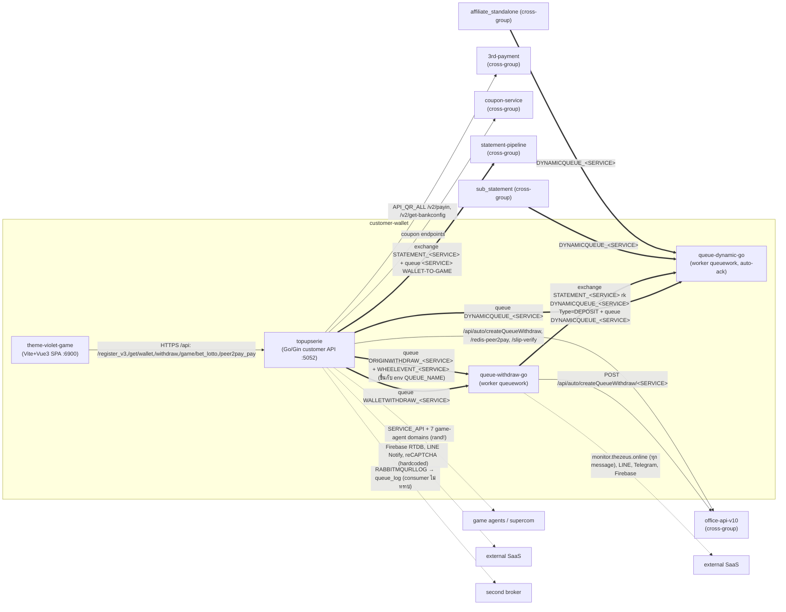
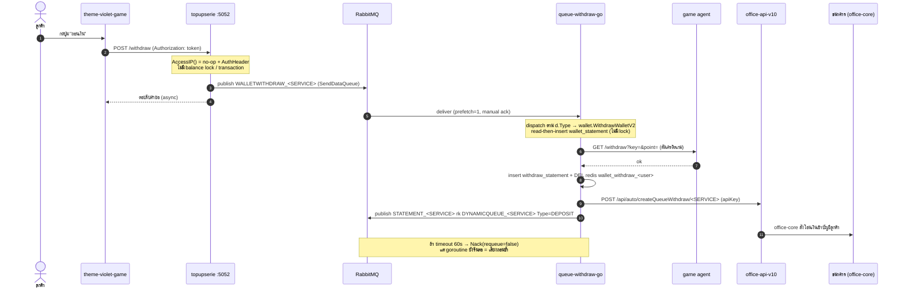

# กลุ่ม customer-wallet — ประตูเงินของลูกค้า

> วิเคราะห์: 2026-06-12 | commit: 40367af | [← กลับหน้าปก](README.md)

สมาชิก: **topupserie** (Go customer API :5052), **theme-violet-game** (Vite+Vue3 frontend ลูกค้า), **queue-withdraw-go** (Go worker), **queue-dynamic-go** (Go worker)

---

## (ก) บทบาทของกลุ่ม

กลุ่มนี้คือ **ประตูหน้าบ้านของลูกค้า** (customer-facing gateway) — เป็นจุดเดียวที่ผู้เล่นจริงสัมผัสระบบ และเป็นเส้นทางที่ **เงินทุกบาทไหลผ่าน** ทั้งขาเข้า (ฝาก) และขาออก (ถอน):

- **theme-violet-game** — SPA (Vite+Vue3, package `ngernn`, "Ngernn Lottery") เว็บหวย/เกมลูกค้า ทำหน้าที่ render หน้า สมัคร/ล็อกอิน/ฝาก/ถอน/แทงหวย/เล่นเกม/affiliate/ranking แล้วยิง REST ทั้งหมดไปที่ `location.origin + /api` (prod ผ่าน ingress) หรือ dev `https://violetgame-homey-dev.thesonicblue.xyz/` — **backend ของมันคือ topupserie** (ยืนยันจาก path ตรงกันทุกตัว)
- **topupserie** — หัวใจของกลุ่ม: Go/Gin API เดียวที่รวม wallet/deposit/withdraw/game/lotto/affiliate/bonus/shop/coupon เปิดสองชุดเส้นทางพร้อมกัน (มาตรฐาน `Route` + APEX path สวีเดน `RouteApexPro`) เป็น **publisher + RPC client** ไม่มี long-lived consumer เอง สั่งงานหนักผ่าน RabbitMQ ไปให้ worker สองตัวด้านล่าง
- **queue-withdraw-go** — worker บริโภค `WALLETWITHDRAW_<SERVICE>` (และ dispatch ตาม `d.Type`: ORIGINWITHDRAW / WALLETWITHDRAW / EVENTACTION / WHEELEVENT) ทำงานตัดเครดิตเกม + สร้าง withdraw_statement + สั่งถอนออโต้ไป office
- **queue-dynamic-go** — worker บริโภค `DYNAMICQUEUE_<SERVICE>` (auto-ack!) ทำ business logic ฝั่ง affiliate/covid (COVIDAFFILIATE / AFFILIATE_LOTTO / COVID_CREDIT / HYDRA_UFA_AFFILIATE) + upsert queue_log

บทบาทสมาชิกโดยสรุป: frontend (1) → API gateway สมาชิก (1) → worker ตัดเงิน (1) → worker สถิติ/affiliate (1). worker ทั้งสองเป็น **fork จาก template เดียวกัน** (module `queuework` ชื่อเดียวกัน, `_config/db.go` เหมือน ~94%, `pub/` โครงเดียวกัน) แต่ business logic คนละชุด

---

## (ข) แผนผังความสัมพันธ์

---

## (ค) ตาราง edge (หลักฐานสองฝั่ง)

| from | to | ชนิด | ชื่อจริง (exact) | หลักฐานสองฝั่ง | conf |
|---|---|---|---|---|---|
| theme-violet-game | topupserie | HTTP REST | base `location.origin+/api` (prod), `violetgame-homey-dev...` (dev); paths `/register_v3`,`/login_line`,`/get/wallet`,`/withdraw`,`/bank/auto`,`/game/bet_lotto`,`/bonus_free`,`/affiliate`,`/peer2pay_pay` | violet: APIService.ts:6-11, RegisterService.ts:6, WalletService.ts:13, WithdrawService.ts:22, LottoService.ts:394, DepositService.ts:155 / topup: route.go:54-55,57,74-78,214,336 (path ตรงทุกตัว) | 🟢 |
| topupserie | queue-withdraw-go | AMQP publish→consume | queue `WALLETWITHDRAW_<SERVICE>` (default exchange) | topup: promotion/shop.go:754,1161; mainService.go:475-478 / qw: QUEUE_NAME=WALLETWITHDRAW + SERVICE → pub/amqp.go:45-86, .env:60,14 | 🟢 |
| topupserie | queue-dynamic-go | AMQP publish→consume | queue `DYNAMICQUEUE_<SERVICE>` | topup: mainService.go:479-492 / qd: pub/amqp.go:33-41 (QueueDeclare durable) | 🟢 |
| topupserie | queue-withdraw-go | AMQP publish→consume | queue `ORIGINWITHDRAW_<SERVICE>` + `WHEELEVENT_<SERVICE>` (dispatch ตาม Type) | topup: covid/register.go:129, mainService.go:680-692,772-784 / qw: pub/amqp.go:121-150 — ขึ้นกับ env `QUEUE_NAME` ของ deployment | 🟡 |
| queue-withdraw-go | queue-dynamic-go | AMQP (intra-group!) | exchange `STATEMENT_<SERVICE>` rk `DYNAMICQUEUE_<SERVICE>` Type=DEPOSIT + queue `DYNAMICQUEUE_<SERVICE>` | qw: helper/wallet.go:92-105, origin/withdraw.go:1224-1250 / qd: pub/amqp.go:33-41,86-91 | 🟢 |
| queue-withdraw-go | [office-api-v10](office-core.md) | HTTP POST | `/api/auto/createQueueWithdraw/<SERVICE>` (apiKey=callback_api_key) | qw: wallet/withdraw.go:394-395,841-842, origin/withdraw.go:1195-1196 (cross-group) | 🟢 |
| topupserie | [office-api-v10](office-core.md) | HTTP POST | `/api/auto/createQueueWithdraw`, `/redis-peer2pay`, `/slip-verify-deposit-statement-by-member` | topup: withdraw.go:522, deposit.go:4140, slipQrcode.go:379 (cross-group) | 🟢 |
| topupserie | [3rd-payment](payment-gateway.md) | HTTP POST | API_QR_ALL `/v2/payin`, `/v2/get-bankconfig`, `/v2/get-bank-support` | topup: deposit.go:520,854,1446 (cross-group) | 🟢 |
| topupserie | [coupon-service](affiliate-promotion.md) | HTTP | coupon endpoints (COUPON_SERVICE) | topup: coupon.go:806,1419,1533,2679 (cross-group) | 🟢 |
| topupserie | [statement-pipeline](statement-pipeline.md) | AMQP publish | exchange `STATEMENT_<SERVICE>` + queue `<SERVICE>` Type=`WALLET-TO-GAME` | topup: mainService.go:1697-1788, deposit.go:3134-3166 (cross-group) | 🟢 |
| [sub_statement](statement-pipeline.md) | queue-dynamic-go | AMQP publish→consume | `DYNAMICQUEUE_<SERVICE>` Type=COVID_CREDIT/COVID_ACCOUNT | qd: pub/amqp.go:86-89 (comment "จาก sub_statement/topupserie") (cross-group) | 🟢 |
| [affiliate_standalone](affiliate-promotion.md) | queue-dynamic-go | AMQP publish→consume | `DYNAMICQUEUE_<SERVICE>` Type=AFFILIATE_LOTTO/COVID_RESET | qd: pub/amqp.go:84-93 (comment "จาก affiliate_standalone") (cross-group) | 🟢 |
| topupserie | game agents / supercom | HTTP (external) | SERVICE_API + 7 hardcoded domain (สุ่ม `rand.Intn`), SUPERCOM_URL | topup: agentService.go:95,125; game.go:7618-7663 | 🟢 |
| topupserie / qw | second broker | AMQP publish | `RABBITMQURLLOG` → queue `queue_log` (consumer ไม่ทราบ) | topup: mainService.go:526-626 | 🟡 |

> หมายเหตุ: edge ไป [game-lotto](game-lotto.md) — topupserie เป็นต้นทางของ `/game/*` และ `/lotto/*` (route.go:308-440) แต่ปลายทาง game-agent อยู่นอกกลุ่มนี้

---

## (ง) Key flows (ทีละ hop)

### Flow 1 — ถอนเงินเต็มเส้น (withdraw chain)
1. **theme-violet-game** `POST /withdraw` (WithdrawService.ts:22) แนบ `Authorization: <token>` (APIService.ts:69-72)
2. **topupserie** `controller.Withdraw` ผ่าน `AccessIP()` (no-op, accessIP.go:18-69) + `AuthHeader` (route.go:57) — **ไม่มี balance lock/transaction**
3. **topupserie** publish `WALLETWITHDRAW_<SERVICE>` (shop.go:754 / mainService.go:475-478) — fire เข้า queue (default exchange)
4. **queue-withdraw-go** consume (prefetch=1, manual ack, pub/amqp.go:78-86) → dispatch ตาม `d.Type` → `wallet.WithdrawWalletV2` (withdraw.go:409)
5. **worker** อ่านยอดล่าสุดจาก `wallet_statement` (FindOne sort datetime:-1, withdraw.go:870-882) แล้ว insert รายการหัก (withdraw.go:562) — **read-then-write ไม่มี transaction**
6. **worker** → game agent `GET /withdraw?key=&point=` ตัดเครดิตเกม (helper/agent.go:111; URL เลือกแบบ `rand.Intn` agent.go:632-664)
7. **worker** insert `withdraw_statement` (withdraw.go:912) + DEL redis `wallet_withdraw_<user>` (pub/amqp.go:134-144)
8. **worker** → `POST /api/auto/createQueueWithdraw/<SERVICE>` ไป [office-api-v10](office-core.md) (withdraw.go:394-395) — office-core ต่อไปสั่งโอนเข้าบัญชีธนาคาร
9. **worker** publish `STATEMENT_<SERVICE>` rk `DYNAMICQUEUE_<SERVICE>` Type=DEPOSIT → [queue-dynamic-go](#) (helper/wallet.go:92-105) บันทึกสถิติ affiliate (intra-group)
10. ถ้า timeout 60s: `Nack(requeue=false)` ไม่ requeue ไม่มี DLQ (pub/amqp.go:188-197) แต่ goroutine งานเดิม **ยังรันต่อ** → เสี่ยงถอนซ้ำ

### Flow 2 — ฝากเงินผ่าน 3rd-payment (deposit)
1. **violet** `POST /peer2pay_pay` / `/bank/auto` / `/decimal` (DepositService.ts:10,28,155)
2. **topupserie** `controller` deposit → เรียก [3rd-payment](payment-gateway.md) `API_QR_ALL /v2/payin` (deposit.go:854) ขอ QR/payin (และ `/v2/get-bankconfig` deposit.go:520)
3. หลังยืนยันสลิป/callback → **topupserie** `go createQueueAddCredit` (fire-and-forget, deposit.go:3132-3176) publish queue `<SERVICE>` Type=`WALLET-TO-GAME` ไป [statement-pipeline](statement-pipeline.md) เติมเครดิตเข้าเกม
4. **topupserie** publish `STATEMENT_<SERVICE>` Type=DEPOSIT (mainService.go:1697-1707) → statement-pipeline บันทึกสถิติ
5. `/g2e_pay_confirm` (payment callback) เปิดรับ **โดยไม่มี AuthHeader** (route.go:84)

### Flow 3 — แทงหวย (lotto bet)
1. **violet** `POST /game/prebet_lotto` (preview) → `POST /game/bet_lotto` (LottoService.ts:362,394)
2. **topupserie** `/game/bet_lotto` ผ่าน AuthHeader (+RateLimit, route.go:336-350) → เขียน `statement_lotto`, `lotto_betdetail`, ตัดเครดิตจาก wallet
3. ผลรางวัล: `GET/POST /game/reward_lotto` (route.go:361-363) → ออก credit; affiliate หวยส่งผ่าน `DYNAMICQUEUE_<SERVICE>` Type=AFFILIATE_LOTTO → [queue-dynamic-go](#) `covid.AffStatementLotto` อัพเดต `ads_statement` (pub/amqp.go:84-85)

---

## (จ) Risk Register

5 หมวด จากการตรวจไฟล์จริง — ทุกข้อมี file:line

### หมวด 1 — Authentication & Authorization (auth ปลอม / endpoint การเงินไม่มี auth)

| # | ความเสี่ยง | ระดับ | file:line | ผลกระทบ | ข้อเสนอ |
|---|---|---|---|---|---|
| 1 | `AccessIP()` เป็น **no-op** (โค้ด IP-allowlist ถูกคอมเมนต์ทั้งหมด) แต่ยังครอบ endpoint สำคัญ — ให้ความปลอดภัยลวง | 🔴 | topupserie middleware/accessIP.go:18-69 | endpoint ที่ "ดูเหมือนมี IP filter" จริง ๆ เปิดให้ทุก IP | ลบ middleware หลอก หรือ implement allowlist จริงจาก CLOUDFLARE_ENDPOINT |
| 2 | money endpoints **ไม่มี auth เลย**: `/peer2pay_withdraw`, `/game_balance`, `/callback_wheel`, `/callback_wheel_multi`, `/g2e_pay_confirm`, `/office/*` (flushall-redis, reset_redis), `/default/report` | 🔴 | topupserie route.go:70,84,112-115,288-294,444 | ใครก็ยิงถอน/ดูยอด/flush redis/จ่ายรางวัลกงล้อได้โดยไม่ต้องล็อกอิน | ใส่ AuthHeader + HMAC signature สำหรับ callback; ย้าย `/office/*` ออกจาก public |
| 3 | JWT secret fallback อ่อน — ถ้า `ACCESS_SECRET` ว่างใช้ค่า `"secret"`; lotto token อายุ ~1 ปี (8765 ชม.) | 🔴 | topupserie service/authJWT.go:35-40,68 | ปลอม token ได้ถ้า env ไม่ถูก set; token ถูกขโมยใช้ได้ยาวมาก | ห้าม fallback (panic ถ้า secret ว่าง); ลดอายุ token |
| 4 | apikey auth = plain string compare กับ env `SECRET_KEY` + `color.Red(mySecret)` พิมพ์ secret ลง log (HMAC ถูกคอมเมนต์) | 🔴 | topupserie middleware/authHeader.go:128-139 | secret รั่วทาง log; ไม่กัน timing/replay | ใช้ HMAC + constant-time compare; ลบ log secret |
| 5 | `AuthHeaderExternal` logic เพี้ยน — `HasPrefix(authHeader, "")` คืน true เสมอ, `TrimPrefix(...,"")` ไม่ตัดอะไร; AES key `tyJo8xRuyA` hardcoded | 🔴 | topupserie middleware/authHeader.go:175-184 | external endpoint cashback/commission ตรวจ prefix ไม่ได้จริง | แก้ prefix check + ย้าย AES key เข้า secret manager |

### หมวด 2 — Money integrity (race / double-spend / idempotency)

| # | ความเสี่ยง | ระดับ | file:line | ผลกระทบ | ข้อเสนอ |
|---|---|---|---|---|---|
| 6 | ถอนเงิน **read-then-insert ไม่มี lock/transaction** — อ่าน wallet_statement ล่าสุดแล้ว insert รายการหัก | 🔴 | queue-withdraw-go wallet/withdraw.go:435-562 (อ่าน 870-882, insert 562) | ถ้ามี replica >1 หรือ message ซ้ำ → ยอดติดลบ/ถอนเกิน | findAndModify atomic หรือ Mongo transaction + Redis distributed lock |
| 7 | Nack(requeue=false) ไม่ requeue + ไม่มี DLQ + timeout goroutine **ยังรันต่อ** (ctx ไม่ส่งเข้า handler) | 🔴 | queue-withdraw-go pub/amqp.go:101-197 (Nack 188-197) | message ถอนหายเงียบ และงานค้างทำซ้ำหลัง Nack = **ถอนซ้ำ** | ส่ง ctx เข้า handler+cancel จริง; ประกาศ DLQ; idempotency key |
| 8 | queue-dynamic-go **auto-ack=true** — ack ทันทีที่ deliver | 🔴 | queue-dynamic-go pub/amqp.go:60 | handler error/process ตาย = สถิติ affiliate + เครดิตโควิดหายถาวร ไม่มี retry | เปลี่ยนเป็น manual ack หลัง handler สำเร็จ (มี `d.Ack(false)` คอมเมนต์ไว้ที่ :121) |
| 9 | เติมเครดิต fire-and-forget `go createQueueAddCredit` — ไม่รอผล ไม่จับ error | 🔴 | topupserie controller/deposit.go:3132-3176 | เครดิตอาจไม่เข้าเกมโดยไม่มีใครรู้; ลูกค้าจ่ายแต่ไม่ได้เครดิต | publish แบบ confirm + reconcile job ตรวจ statement ที่ค้าง |
| 10 | `CorrelationId = time.Now().Unix()` (วินาที) ใช้จับคู่ RPC response | 🟠 | topupserie service/mainService.go:469,598,678,770 | สองคำขอในวินาทีเดียวกันชน correlation = ผลลัพธ์สลับ | ใช้ UUID เป็น CorrelationId |
| 11 | กันซ้ำด้วย hash resolution แค่ระดับนาที + bug ใส่ Hour ซ้ำสองครั้ง | 🟠 | queue-withdraw-go wallet/withdraw.go:540-541; helper/helper.go:280 | กันถอนซ้ำได้แค่ภายในนาทีเดียว และ window ผิด | hash รวม request-id/UUID ไม่อิงเวลา |

### หมวด 3 — Infrastructure & queue durability

| # | ความเสี่ยง | ระดับ | file:line | ผลกระทบ | ข้อเสนอ |
|---|---|---|---|---|---|
| 12 | queue `WALLETWITHDRAW_<SERVICE>` **ไม่ durable** (durable=false) | 🔴 | queue-withdraw-go pub/amqp.go:47 | RabbitMQ restart → ข้อความถอนเงินที่ค้างใน queue หายหมด | durable=true + persistent message + publisher confirm |
| 13 | เลือกบัญชีธนาคารตัวสุดท้ายใน loop ไม่ใช่ตัวที่ user เลือก (วน BankList ทับ currentBank) | 🔴 | queue-withdraw-go wallet/withdraw.go:481-490 | โอนเงินผิดบัญชีปลายทาง | match bank ตาม id ที่ลูกค้าเลือก ไม่ใช่ค่าสุดท้ายของ loop |
| 14 | RABBITMQURLLOG = second broker, queue `queue_log` — ไม่ทราบ consumer | 🟠 | topupserie service/mainService.go:526-626 | log การเงินอาจไม่มีใครบริโภค / โตไม่จำกัด | ระบุ consumer + retention policy (ดู Unknown) |
| 15 | game agent URL เลือกแบบ `rand.Intn` ระหว่าง 7 domain hardcoded | 🟠 | queue-withdraw-go helper/agent.go:618-685 (เรียก origin/withdraw.go:42); topupserie agentService.go | ผลถอนไม่ deterministic; debug ยาก; domain ตายตัว 1 ตัวพาระบบล่มบางครั้ง | service discovery/config แทน rand + health check |
| 16 | HTTP client ไม่มี timeout หลายจุด (`http.Client{}` เปล่า, axios default) | 🟠 | topupserie mainService.go:1481,1501; queue-withdraw-go helper/agent.go, helper.go:161 | agent ค้าง → goroutine/connection ค้างสะสม | ตั้ง Timeout ทุก client |

### หมวด 4 — Secrets & credentials (committed / hardcoded)

| # | ความเสี่ยง | ระดับ | file:line | ผลกระทบ | ข้อเสนอ |
|---|---|---|---|---|---|
| 17 | `.env` commit ลง repo พร้อม **MongoDB Atlas prod-like creds** + `ACCESS_SECRET=ABAsercretPayload` | 🔴 | queue-withdraw-go .env:3,7,10 (Atlas root creds) | ใครเข้าถึง repo เข้าถึง DB การเงิน + ปลอม JWT ได้ | rotate ทันที + เอา .env ออกจาก git + secret manager |
| 18 | hardcoded LINE Notify token (`pKahNdB8...`), reCAPTCHA secret (`6LdjBBci...`), Telegram bot token (`7546574244:AAHX...`) | 🔴 | topupserie _config/db.go:134, captcha.go:39-40; queue-withdraw-go helper/helper.go:383 | secret รั่วถาวรใน history; reCAPTCHA/LINE/Telegram ถูกแอบใช้ | rotate ทั้งหมด + ย้ายเข้า env/secret store |
| 19 | hardcoded prod IP `18.138.225.205` (4 port) ในโค้ด login/migration | 🟠 | topupserie service/loginService.go:133-139,193 | ผูก infra ตายตัว; เปลี่ยน IP ต้อง redeploy | config endpoint ผ่าน env |
| 20 | Sentry DSN + Session Replay + Firebase config hardcode ใน client bundle | 🟠 | theme-violet-game src/main.ts:55-71; src/stores/firebase.ts:19-27 | replay บันทึก session เว็บพนันส่งขึ้น sentry.io; Firebase key เปิดเผย | ใช้ env build-time + จำกัด Firebase rules; พิจารณาปิด replay |

### หมวด 5 — Frontend / session security

| # | ความเสี่ยง | ระดับ | file:line | ผลกระทบ | ข้อเสนอ |
|---|---|---|---|---|---|
| 21 | token เก็บใน cookie **อายุ 1 ปี** + localStorage (อ่านได้จาก XSS) | 🔴 | theme-violet-game vue-auth3.ts:30; APIService.ts:46; stores/seamless.ts:43 | token ถูกขโมยใช้ได้ยาวมาก; XSS ดึง token จาก localStorage | httpOnly+Secure cookie อายุสั้น; ไม่เก็บ token ใน localStorage |
| 22 | credential ใน URL — seamless `GET /login?key=&username=`, `regis-token` จาก query string | 🟠 | theme-violet-game SeamlessService.ts:6; App.vue:247,251 | token ติด browser history / proxy log / referer | ส่ง credential ใน body/header ไม่ใช่ query |
| 23 | reverse proxy `/api` ไม่อยู่ใน repo (nginx.conf ไม่มี location /api) | 🟠 | theme-violet-game .nginx/nginx.conf (ไม่มี); url_config.ts:31 | routing การเงินอยู่ที่ ingress นอก repo — แก้/ตรวจสอบยาก | document ingress config (ดู Unknown) |

### ✅ ตรวจแล้วผ่าน (ไม่เป็นความเสี่ยงตามที่อาจคาด)
- **queue-withdraw-go ใช้ manual ack + prefetch=1** (pub/amqp.go:63-86) — ป้องกัน redelivery แบบ burst และจำกัด in-flight 1 ข้อความต่อ consumer (กัน race ระดับ instance เดียว) ✅ แต่ป้องกันได้เฉพาะกรณี **single instance** เท่านั้น (ดู #6)
- **มี Redis lock บางจุด** — key `wallet_withdraw_<username>` ใช้กันถอนซ้ำ (set ที่ topupserie, DEL ที่ qw pub/amqp.go:134-144) ✅ มีกลไกอยู่ แต่ DEL หลังประมวลผล ไม่ใช่ SET-NX ก่อน + ไม่มี TTL guard ที่นี่ → ไม่ใช่ lock ที่กันได้สมบูรณ์
- **queue-dynamic-go queue เป็น durable=true** (pub/amqp.go:33-41) ✅ ต่างจาก queue-withdraw-go ที่ durable=false — แต่ถูกหักล้างด้วย auto-ack (#8)

### ❓ ข้อสงสัย (ยังไม่ยืนยัน)
- การ route `ORIGINWITHDRAW_<SERVICE>` / `WHEELEVENT_<SERVICE>` เข้า queue-withdraw-go ขึ้นกับ env `QUEUE_NAME` ของ deployment จริง — ในโค้ด `.env` ตั้ง `QUEUE_NAME=WALLETWITHDRAW` เท่านั้น (qw .env:60); ถ้า deploy แยก instance ต่อ Type เส้น 🟡 นี้อาจไม่เกิด — ต้องดู manifest k8s
- Redis lock ฝั่ง **set** อยู่ repo ไหน — qw มีแต่ DEL (pub/amqp.go:134-144), การ set อยู่นอกไฟล์ที่ตรวจ — ยังไม่ยืนยันว่ามี TTL/atomicity

---

## (ฉ) Unknown — ยังไม่ปิด

1. **consumer ของ `RABBITMQURLLOG` → queue `queue_log`** — topupserie + qw publish log การเงินไป broker ที่สอง (mainService.go:526-626) แต่ไม่พบ consumer ในกลุ่มนี้ (queue-dynamic-go บริโภค `queue_log` ผ่าน `DynamicQueue=true` บน broker หลัก ไม่ใช่ RABBITMQURLLOG) — ปลายทาง broker ที่สองยังไม่ทราบ
2. **ปลายทางของ `MINIGAME_API`, `APIWHEEL`, `MIGRATE_URL`** — topupserie เรียก (minigame.go:258, wheel.go:125, loginService.go:122) แต่ base URL runtime-injected ว่าง; ไม่รู้ว่าชี้ service ใดในระบบ
3. **seamless `BASE_URL = ''`** (เดิม `https://lotto-seamless-api.hammerstone.xyz/api`) — theme-violet UserService.ts:3-4, LottoService.ts:67-68 — ปัจจุบัน prefix ว่าง = base เดียวกับ topupserie หรือไม่ ยังไม่ชัด (hammerstone เดิมอาจเป็น backend แยก)
4. **nginx `/api` reverse proxy** — client เรียก `location.origin+/api` แต่ nginx.conf ใน repo ไม่มี `location /api` — proxy อยู่ที่ ingress นอก repo (ไม่เห็นในกลุ่มนี้)
5. **env `QUEUE_NAME` จริงของแต่ละ deployment** — queue-dynamic-go ไม่มี `.env` ใน repo (gitignore) ทราบชื่อ queue ได้จากฝั่ง producer เท่านั้น — mapping Type→worker จริงต้องยืนยันจาก k8s manifest

---

> ลิงก์กลุ่มอื่น: [office-core](office-core.md) · [payment-gateway](payment-gateway.md) · [statement-pipeline](statement-pipeline.md) · [affiliate-promotion](affiliate-promotion.md) · [game-lotto](game-lotto.md)
