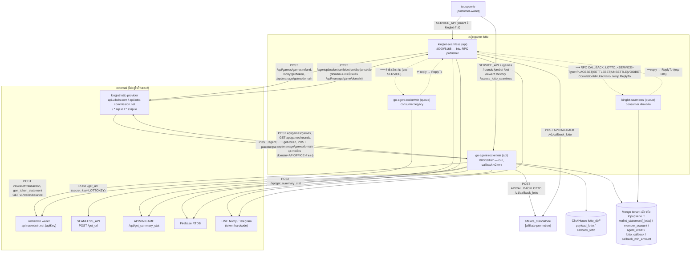
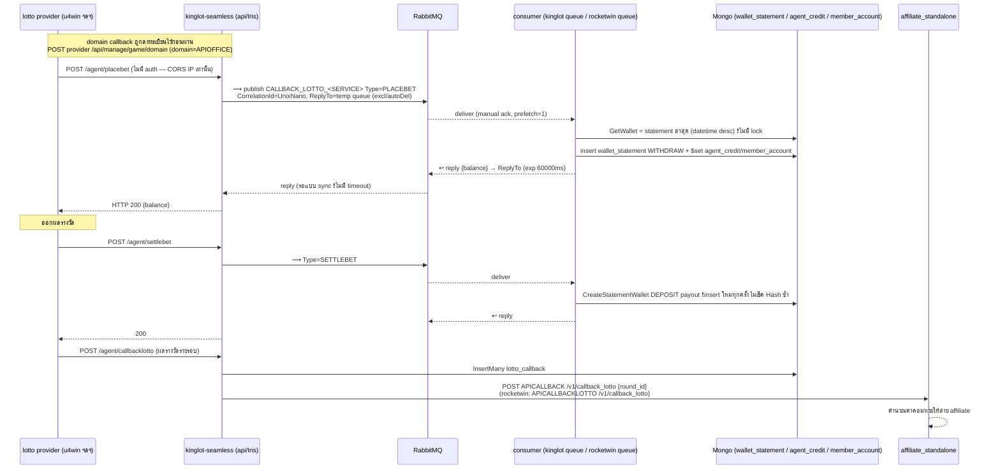

# กลุ่ม: game-lotto

> วิเคราะห์: 2026-06-12 | commit: 40367af | [← กลับหน้าปก](README.md)

สมาชิก: **go-agent-rocketwin** · **kinglot-seamless**
ดูกลุ่มที่เกี่ยวข้อง: [office-core](office-core.md) · [customer-wallet](customer-wallet.md) · [affiliate-promotion](affiliate-promotion.md)

---

## (ก) บทบาทของกลุ่ม

กลุ่มนี้คือ **"กระเป๋าเงิน seamless ของเกม/หวย"** — ทุกครั้งที่ผู้เล่นแทงหวยหรือเล่นเกม เงินเครดิต **ขยับจริงทันที** ผ่าน callback 4 จังหวะ: `placebet` (ตัดเงิน) → `settlebet` (จ่ายรางวัล) → `voidbet`/`unsettle` (คืน/ดึงกลับ) ความผิดพลาดใดๆ ในกลุ่มนี้ = เครดิตลูกค้าหาย/เกิน ทันที และเพราะเป็น seamless (เจ้าของยอดเงินอยู่ฝั่งเรา ไม่ใช่ provider) จุดอ่อนด้าน idempotency/race จึงแปลงเป็นเงินรั่วโดยตรง

สมาชิกสองตัวเป็น **RPC pair** บนคิวเดียวกัน: kinglot-seamless (โหมด api) แปลง HTTP callback → RabbitMQ RPC ไปคิว `CALLBACK_LOTTO_<SERVICE>` แล้วรอ reply แบบ sync ส่วนฝั่ง consumer (ทั้ง kinglot โหมด queue และ go-agent-rocketwin โหมด queue ต่างก็ consume คิวชื่อเดียวกันตาม env `SERVICE`) เป็นผู้เคลื่อนเงินจริง

| สมาชิก | บทบาท | รูปแบบ |
|---|---|---|
| **go-agent-rocketwin** | เกมเอเย่นต์ 2 ฝั่งในตัวเดียว — (1) seamless wallet เกม rocketwin (ตัด/เพิ่มเครดิตจริงผ่าน `api.rocketwin.net`) (2) lotto agent ของ kinglot รับ callback v2 ที่เคลื่อนเงิน + push ClickHouse `lotto_dbF` | Go/Gin `:8000` (docker 8167), dual-mode `SERVICE_METHODS=api\|queue` — `_cmd/main.go:35-43` |
| **kinglot-seamless** | seamless wallet หวย kinglot — เจ้าของยอด `wallet_statement`/`agent_credit`/`member_account` เอง, เป็นทั้ง RPC publisher (api) และ consumer ตัดเครดิต (queue) | Go/**Iris v12** `:8000` (docker 8168), dual-mode — `_cmd/main.go:24-31` |

---

## (ข) แผนผังและลำดับเหตุการณ์

### Mermaid — กราฟความสัมพันธ์ (label = ชื่อจริง)

> หมายเหตุ shared-data 💾: ทั้งสองตัวเขียน/อ่าน collection การเงิน (`wallet_statement_lotto`, `wallet_statement`, `member_account`, `lotto_callback`, `callback_min_amount`) บน **Mongo tenant DB เดียวกับ topupserie** (`MONGODB_DB_NAME`) — เป็น boundary ที่ข้ามกันด้วยข้อมูล ไม่ใช่ API; rocketwin มี ClickHouse `lotto_dbF` เพิ่มสำหรับ analytics — card go-agent-rocketwin §data, card topupserie:122,133

### sequenceDiagram — "วาง bet → settle" ผ่าน RPC `CALLBACK_LOTTO_<SERVICE>` + จ่าย affiliate

> ฝั่ง **go-agent-rocketwin** เส้นเดียวกันแต่ไม่ผ่านคิว: provider → POST `/agent/placebet` (Gin handler ตรง, มี Redis lock 25s) → ตัดเงินจริงที่ `api.rocketwin.net` `v1/wallet/transaction` → อัปเดต `wallet_statement_lotto` ใน goroutine — `route.go:142-152`, `bet/bet.go:80-105,360-423`

---

## (ค) ตาราง Edge (intra + cross-group)

| from | to | ชนิด | ชื่อจริง | หลักฐานสองฝั่ง | conf |
|---|---|---|---|---|---|
| kinglot-seamless (api) | kinglot-seamless (queue) / go-agent-rocketwin (queue) | AMQP **RPC (intra!)** | ⟿ `CALLBACK_LOTTO_<SERVICE>` Type=`PLACEBET\|SETTLEBET\|UNSETTLE\|VOIDBET`, CorrelationId=UnixNano, temp ReplyTo, exp 60000ms | pub `method/service.go:130-148` ↔ recv kinglot `rabbitmqlotto/worker.go:33-66,95-178` + rocketwin `rabbitmqlotto/worker.go:55-159` (manual ack, prefetch=1) | 🟢 |
| go-agent-rocketwin | affiliate_standalone | HTTP | POST `<APICALLBACKLOTTO>/v1/callback_lotto` (round_id หลัง callbacklotto) | sender `callbacklotto/callbacklotto.go:65,86` ↔ recv ฝั่ง aff (cross-group, ยืนยันแล้ว) | 🟢 |
| kinglot-seamless | affiliate_standalone | HTTP | POST `<APICALLBACK>/v1/callback_lotto` | sender `callback/bet.go:922,955` ↔ recv ฝั่ง aff | 🟢 |
| topupserie | game-lotto (`/agent/*`) | HTTP | `SERVICE_API` + `/games /rounds /bet /prebet /history /reward /reward_bygroup /gamesbyname /group /check_bet_set /access_lotto_seamless` | sender `topupserie/controller/game.go:3326,3617,4212,4229,4337,4395,4904,5510,5935,6026,7795` ↔ recv rocketwin `route.go:104-138` + kinglot `server.go:96-119`; บรรทัด comment `ReplaceAll(API_AGENT,"/agent","/v2/agent")` (`game.go:4211`) ยืนยันว่า base ลงท้าย `/agent` ตรงกับ `/v2/agent` ของ rocketwin | 🟢 (path-shape; instance ต่อ tenant เป็น runtime config 🟡) |
| lotto provider (u4win ฯลฯ) | ทั้งสองสมาชิก | HTTP **(inbound เงินจริง)** | POST `<domain>/agent/placebet\|settlebet\|voidbet\|unsettle\|callbacklotto`, GET `/agent/balance` — domain ลงทะเบียนผ่าน `/api/manage/game/domain` (payload `domain=APIOFFICE`, response มี url `place_bet/settle_bet/void_bet`) | register rocketwin `exernal.go:52-75,115-134` + kinglot `callback/bet.go:1781-1842` ↔ recv `route.go:129-152` / `server.go:68-128` | 🟢 (provider อยู่นอกโฟลเดอร์) |
| go-agent-rocketwin | rocketwin wallet (ext) | HTTP | `api.rocketwin.net` POST `v1/wallet/transaction`, `v1/wallet/gen_token_statement`, GET `v1/wallet/balance` — header `apiKey` (**เงินจริง**) | `rocketwin_service/createTransaction.go:28`, `createToken.go:24`, `getwallet.go:34`; legacy `rabbitmqlotto/callrocketwin.go:56-154` | 🟢 |
| ทั้งสอง | kinglot lotto API (ext) | HTTP | `api.u4win.com`/`api.lotto-commission.net`/`*.nip.io`/`*.sslip.io` — POST `api/games/games\|refund`, GET `rounds`, `get-token`, `secret-key` — Bearer + `secret_key` | rocketwin `kinglot_service/bet.go:22-25`, `loginlotto.go:21,51` ; kinglot `game/bet.go:105,301`, `callback/login.go:48` | 🟢 |
| go-agent-rocketwin | SEAMLESS_API (ext) | HTTP | POST `<SEAMLESS_API>/get_url` (body `secret_key=LOTTOKEY`) — ขอ url เข้าเกมหวย | sender `access_seamless.go:62-74` — ปลายทางไม่อยู่ในโฟลเดอร์ | 🟡 |
| ทั้งสอง | APIMINIGAME (ext) | HTTP | POST `/api/get_summary_stat` (turnover minigame) | rocketwin `transaction.go:1629,1644` ; kinglot `callback/bet.go:1576` | 🟡 |
| go-agent-rocketwin | ClickHouse | DATA | insert `payload_lotto` (batch 500 จาก redis `queue_settle_bet_clickhouse_*`), `callback_lotto` — db `lotto_dbF` | `repo/repo_clickhouse.go:95,201`, `settlebet/worker.go:191` | 🟢 |
| ทั้งสอง ↔ topupserie | (shared Mongo) 💾 | DATA | `wallet_statement_lotto`, `wallet_statement`, `member_account`, `lotto_callback`, `callback_min_amount` — tenant DB เดียวกัน | rocketwin `bet/bet_util.go:108`, `settlbet_utils.go:68` ; kinglot `callback/db.go:38-152` ; topupserie card:122,133 | 🟢 |
| ทั้งสอง | Firebase / LINE / Telegram (ext) | HTTP | PUT `/notify/creditagent\|ratelotto/...json` ; notify-api.line.me (token hardcode) | rocketwin `wallet.go:276-284`, `telegramService.go:11,36` ; kinglot `method/service.go:262-269`, `linenoti.go` | 🟢 |
| ~~go-agent-rocketwin → office-api-v10~~ | — | — | **เส้นนี้ตกไป** — `/api/manage/game/domain` ยิงไป `construct.APIURL` = lotto provider ภายนอก (`TYPELOTTO`) ไม่ใช่ office; grep `manage/game` ใน office-api-v10 ไม่พบ route; env `APIOFFICE` เป็นแค่ **payload** (โดเมน callback ของ agent เอง — verify ด้วย GET `<APIOFFICE>/agent/` ซึ่งคือ route ของตัวเอง `route.go:24`) | `exernal.go:34-37,56-65` ; kinglot `bet.go:1803-1808` | ❌ rejected |

---

## (ง) Key Flows

### Flow 1 — placebet → settlebet เต็มวง (เส้น kinglot RPC)

1. ผู้เล่นกดแทงผ่านหน้าเว็บ → topupserie `/game/bet_lotto` / `/game/access_lotto_seamless` (`topupserie/route.go:336,374`) → ยิง `SERVICE_API + /prebet|/bet|/access_lotto_seamless` มาที่ agent (`game.go:4229,4212,7795`) → agent ส่งต่อ provider `POST api/games/games` (`kinglot_service/bet.go:22` / `game/bet.go:105`)
2. provider ประมวลผลแล้วยิง callback กลับ **POST `<domain>/agent/placebet`** (domain ที่ลงทะเบียนไว้ตอน InitConfig) — ไม่มี auth, ผ่านแค่ CORS IP (`server.go:75,147`)
3. kinglot api-mode `method.ReciveRequest("PLACEBET")` ⟿ publish `CALLBACK_LOTTO_<SERVICE>` + สร้าง temp reply queue แล้ว **block รอ correlation id** (`method/service.go:67-148,170-176`)
4. consumer (queue-mode) รับ (manual ack, prefetch=1, `worker.go:33-66`) → dispatch `PLACEBET` → `callback.PlaceBetQueue`
5. 💾 `GetWallet` = อ่าน `wallet_statement` รายการล่าสุด (datetime desc, `callback/db.go:34-42`) → เช็ค balance พอ (`bet.go:526`) → insert statement WITHDRAW (`bet.go:766-814`) → `$set` ยอดใหม่ลง `agent_credit`/`member_account` (`wallet.go:371-401`, `db.go:98,137`)
6. ↩ reply balance → ReplyTo (exp 60000ms, `worker.go:182-192`) → api-mode ตอบ HTTP 200 ให้ provider
7. ออกผล: provider → **POST `/agent/settlebet`** → RPC `SETTLEBET` → `SettleBetQueue` insert statement DEPOSIT = จ่าย payout (ไม่เช็ค txid ซ้ำ — ดู R1)
8. provider → **POST `/agent/callbacklotto`** ผลรายรอบ → 💾 InsertMany `lotto_callback` (`db.go:152`) → POST `<APICALLBACK>/v1/callback_lotto` ไป [affiliate-promotion](affiliate-promotion.md) จ่ายค่าคอมสาย (`bet.go:922,955`)

**variant rocketwin (ไม่ผ่านคิว):** provider → `/agent/placebet` (Gin) → Redis lock `<username>_bet` 25s (`bet/bet.go:80-105`) → **ตัดเงินจริง** ที่ `api.rocketwin.net` `v1/wallet/transaction` (`createTransaction.go:28`) → อัปเดต `wallet_statement_lotto` ใน `go func()` (`bet/bet.go:360-423`); settle เข้า redis queue `queue_settle_bet_fast_work_*` → background `ScanQueueSettleBetFast` จ่ายรางวัล (`settlebet/worker.go:33,272`) + push ClickHouse `payload_lotto` (`worker.go:37-77`); จบรอบยิง `<APICALLBACKLOTTO>/v1/callback_lotto` (`callbacklotto.go:86`)

### Flow 2 — voidbet / unsettle (ยกเลิกบิล / ดึงรางวัลกลับ)

1. provider ยิง **POST `/agent/voidbet`** (ยกเลิกบิล → คืนเงินที่ตัดไป) หรือ **POST `/agent/unsettle`** (settle ผิด → ดึง payout กลับ)
2. kinglot: RPC Type=`VOIDBET`/`UNSETTLE` → `VoidBetQueue` (DEPOSIT คืนเงิน) / `UnSettleBetQueue` (WITHDRAW ดึงกลับ) — `worker.go:95-178`; rocketwin queue-mode เส้นเดียวกัน: `voidBetQueue` (`worker.go:319-352`), `unSettleBetQueue` (`worker.go:247-317`)
3. 💾 ทั้งคู่ใช้ `CreateStatementWallet` ตัวเดียวกับ settle — insert statement ใหม่ + `$set` ยอด **โดยไม่มี lock และไม่เช็คซ้ำ** → void ซ้ำ = คืนเงินสองรอบ (R1/R3)
4. ข้อยกเว้นเงียบ: ฝั่ง legacy rocketwin `CreateStatementWallet` คืน `true,nil` เมื่อ SETTLEBET/UNSETTLE `payout<=0` โดยไม่เขียน statement (`rabbitmqlotto/func.go:118-124`) — provider เป็นผู้กำหนด payout ฝ่ายเดียว ไม่มีการ validate ฝั่งเรา (kinglot `bet.go:131,448-503` เช่นกัน)
5. unsettle ฝั่ง rocketwin ตามด้วย reconcile ใน `ScanQueueSettleBetSlow` (pop `queu_settle_bet_slow_work` — สะกดผิดในโค้ดจริง, `worker.go:278-367`)

---

## (จ) Risk Register

| # | ความเสี่ยง | ระดับ | file:line | ผลกระทบ | ข้อเสนอ |
|---|---|---|---|---|---|
| **R1** | **[เงิน/idempotency] kinglot settle ไม่มี idempotency จริง** — `CreateStatementWallet` คำนวณ `AfterCredit=±point` แล้ว **insert ใหม่ทุกครั้ง** ไม่เช็ค txid/Hash ซ้ำก่อน; field `Hash=<txid><type><recaltimes>` ถูกเขียนแต่ไม่ถูกใช้กันซ้ำ | 🔴 | kinglot `callback/bet.go:766-814` | **replay `settlebet` = จ่าย payout ซ้ำได้เต็มๆ** — ผสมกับ R6 (ไม่มี auth) ยิงซ้ำจากนอกได้ | unique index บน `hash`, insert-if-not-exists, ตอบ success เดิมเมื่อซ้ำ |
| **R2** | **[เงิน/idempotency] rocketwin settle เป็น check-then-act ไม่ atomic** — กันซ้ำด้วย `checkHash` + เช็ค `status==1` ก่อนค่อยสร้าง ไม่มี unique index | 🔴 | rocketwin `settlebet/settlbet_utils.go:28`, `settlebet/settlebet.go:51-65` | settlebet 2 ตัวพร้อมกัน txid เดียว → ผ่าน check ทั้งคู่ → จ่ายซ้ำ | unique index `hash` + upsert; ขยับ dedup ลง DB layer |
| **R3** | **[concurrency] read-modify-write `agent_credit`/`member_account` ไม่ atomic** — อ่าน balance → บวกลบใน Go → `UpdateAgentCredit` ด้วย `$set` (ไม่ใช่ `$inc`) ไม่มี transaction | 🔴 | kinglot `callback/wallet.go:371,396-401`, `db.go:98,137` | bet/settle พร้อมกันบนเอเย่นต์/ยูสเดียว → **lost update ยอดเครดิตเพี้ยนถาวร** | เปลี่ยนเป็น `$inc` + conditional update (`balance>=amount`) |
| **R4** | **[concurrency] GetWallet อิง statement ล่าสุดเป็น balance + ไม่มี Redis lock ทั้ง repo** — kinglot ไม่มี Redis เลย กันซ้ำด้วย `service_log` collection ซึ่งเป็น log ไม่ใช่ mutex | 🔴 | kinglot `callback/db.go:34-42`, `db.go:342`, `bet.go:692-713` | 2 request พร้อมกันอ่าน balance เดียวกันก่อนเขียน → ตัดเกิน/**balance ติดลบ** | distributed lock ต่อ username หรือ optimistic version บน statement |
| **R5** | **[เงิน] PlaceBet rocketwin ตัดเงินจริงก่อน แล้วอัปเดต statement ใน goroutine** — `CreateTransaction` (เงินออกที่ rocketwin) สำเร็จแล้วค่อย update `wallet_statement_lotto` ใน `go func()` ไม่มี retry/outbox | 🔴 | rocketwin `bet/bet.go:360-423` | goroutine ตาย/DB ล่ม → เงินถูกตัดแต่ ledger ไม่บันทึก = balance ไม่ตรง reconcile ไม่ได้ | เขียน statement (pending) ก่อนตัดเงิน แล้ว confirm; outbox pattern |
| **R6** | **[auth] callback ที่เคลื่อนเงินไม่มี auth ทั้งสองตัว** — `/agent/placebet\|settlebet\|voidbet\|unsettle` กันด้วย CORS IP allowlist (~40 IP hardcode) เท่านั้น, dev/uat เปิด `*`; rocketwin ซ้ำ 2 path (`/agent` + `/v2/agent`); kinglot กลุ่ม `/agent` ไม่ติด `method.Authentication` (ต่างจาก `/api/v1`) | 🔴 | rocketwin `server.go:210-231`, `route.go:142-170` ; kinglot `server.go:75,147,193-201` | ใครเดา/ปลอม IP ใน allowlist ยิง `settlebet` = **พิมพ์เครดิตฟรี** (ผสม R1 ไม่ต้องเดา txid ใหม่ด้วยซ้ำ) | บังคับ signature (HMAC ต่อ txid) + ผูก `AUTHEN` Bearer กับกลุ่ม `/agent` |
| **R7** | **[secret] fallback secret hardcode + .env commit ทั้งคู่** — `APIKEY==""` → ใช้ `"RnMptogBXKYmi6eWt9737M00lgKI9TDR"` ยิง login ไป lotto; `.env` มี Mongo root (`root:Zxcvasdf789@...`), `APIKEY`, `CLICKHOUSE_PASSWORD`, `ACCESSTOKEN_SECRET_*`; LINE/Telegram token hardcode ในโค้ด | 🔴 | kinglot `callback/login.go:44-45`, `.env:3,7,20-23` ; rocketwin `.env:2,6,40`, `telegramService.go:11,36`, `callrocketwin.go:195` | secret อยู่ใน git history = รั่วถาวร; Mongo root = ยึด tenant DB การเงินทั้งก้อน | rotate ทันที, ลบ fallback, ย้าย secret manager, purge history |
| **R8** | **[resilience] RPC publisher ไม่มี timeout** — `PublishQueue` `for d := range msgs` รอ correlation id โดยไม่มี context/timeout; consumer ไม่ตอบ = HTTP request จาก provider **ค้างถาวร** | 🟠 | kinglot `method/service.go:170-176` | connection สะสม → api-mode หมด resource; provider เจอ timeout ฝั่งเขาแล้ว retry → ยิงซ้ำเข้า R1 | context.WithTimeout (< exp 60s) + ตอบ 504 |
| **R9** | **[resilience] worker error → `return` ออกจาก consume loop** — Unmarshal/Marshal/Publish fail ใน goroutine consume ทำ `return` → **หยุดรับทั้ง queue เงียบๆ** จนกว่า restart; message พิษ 1 ตัวฆ่า consumer ได้ | 🟠 | kinglot `rabbitmqlotto/worker.go:74-77,170-176,189-192` | bet/settle ทุก tenant บน SERVICE นั้นหยุดเดิน, HTTP ฝั่ง publisher ค้าง (R8) ต่อเนื่อง | `continue`+Nack/DLQ แทน return; healthcheck consumer |
| **R10** | **[resilience] HTTP client outbound ไม่มี timeout ทั้งคู่** — `HttpHandle` สร้าง `&http.Client{}` เปล่า; `checkDomain` มี Transport แต่ไม่ตั้ง client.Timeout; monaco-io `CallAPI` ไม่ตั้ง; แถม rocketwin `HttpHandle` comment การเช็ค err หลัง `client.Do` แล้ว `defer resp.Body.Close()` ทันที → nil deref panic ได้ | 🟠 | rocketwin `rocketwinService.go:189-196`, `exernal.go:84-90`, `http_service.go:48` ; kinglot `method/callapi.go:46-54`, `callback/bet.go:1826-1831` | provider ค้าง = goroutine/connection รั่วสะสม; network error = panic กลาง handler เงิน | ตั้ง Timeout ทุก client, คืนการเช็ค err ก่อนใช้ resp |
| **R11** | **[เงิน/config] settleBetFastwork ไม่เรียก wallet จริงสำหรับ theme non-VIOLET** — แค่ `GetWallet` แล้วคำนวณ `balance+payout` เขียน statement โดย**ไม่สร้าง transaction ที่ rocketwin** — เครดิตที่จ่ายจริงขึ้นกับ `THEMEMODE` | 🟠 | rocketwin `settlebet/settlbet_utils.go:192-214`, `settlebet/settlebet.go:174-215` | config theme ผิด tenant เดียว = ledger บอกจ่ายแล้วแต่เงินจริงไม่ขยับ (หรือกลับกัน) | รวม path การจ่ายให้เหลือทางเดียว, assert โหมดตอน boot |
| **R12** | **[concurrency] Redis lock ฝั่ง rocketwin สั้นกว่างาน + settle/void/unsettle ไม่ล็อกเลย** — bet ล็อก 25s แต่ตัดเงินมี retry token 3×2s + transaction → lock หมดอายุก่อนงานจบได้; settle path ไม่มี lock | 🟠 | rocketwin `bet/bet.go:80-105` (lock เฉพาะ bet) ; settle ไม่มี — `settlbet_utils.go` | งานซ้อนทับช่วงท้าย lock → statement ซ้ำ/ยอดเพี้ยน | lock TTL > worst-case + ต่ออายุ, ล็อก settle ด้วย key txid |
| **R13** | **[ops] SERVICE env ไม่ตรงกันระหว่าง publisher/consumer = reply ไม่ถึง** — คิว `CALLBACK_LOTTO_<SERVICE>` ผูก `os.Getenv("SERVICE")` ทั้งสองฝั่ง สองโหมด deploy แยกกัน | 🟡 | kinglot `method/service.go:131`, `worker.go:33` | config เพี้ยนหนึ่งฝั่ง → ทุก callback ค้าง (เข้า R8) แบบหาเหตุยาก | validate ตอน boot + alert เมื่อคิวไม่มี consumer |

### ✅ ตรวจแล้วผ่าน (จุดที่ทำถูก)

- **PlaceBet ฝั่ง rocketwin มี Redis lock ต่อ username 25s** (`AcquireLock`/`UnlockFunc`) ก่อนตัดเงิน — `bet/bet.go:80-105` (แม้ TTL จะสั้นไป ดู R12)
- **Consumer ทั้งคู่ใช้ manual ack + prefetch=1** — serialize ทีละ message ลด race ใน worker เดียว — rocketwin `worker.go:55-90` ; kinglot `worker.go:33-66`
- **reply message มี Expiration 60000ms** — reply ที่ไม่มีใครรับไม่ค้างในคิวถาวร — `worker.go:149-159` / `worker.go:182-192`
- **kinglot กลุ่ม `/api/v1` มี `method.Authentication`** (Bearer `AUTHEN`) — โครง auth มีอยู่แล้ว เหลือบังคับใช้กับ `/agent` — `server.go:62-72`, `method/middleware.go:9-25`
- **rocketwin CreateToken/GetWallet ตั้ง timeout 30s** — `enum/rocketwin.go:13-14`; ClickHouse push เป็น batch 500 แยก background ไม่บล็อก settle — `settlebet/worker.go:32,191`

### ❓ ข้อสงสัย (ยังไม่ยืนยัน)

- `AUTHEN` ใน production ตั้งค่าจริงหรือไม่ — ถ้า `AUTHEN==""` middleware **ข้ามการตรวจทั้งหมด** (`method/middleware.go:9-25`) แปลว่าแม้ `/api/v1` ก็อาจเปิดโล่ง
- rocketwin โหมด queue (legacy `rabbitmqlotto`) ยังถูกใช้ deploy จริงคู่กับ kinglot หรือเลิกแล้ว — โค้ด consume คิวชื่อเดียวกันอยู่ แต่ไม่เห็น env/compose ที่ยืนยันว่า SERVICE ชนกันจริง (`worker.go:55`)
- `APICALLBACK` ฝั่ง rocketwin (`transaction.go:718,724`) อยู่ใน comment block — เส้น affiliate ของ rocketwin จึงเหลือ `APICALLBACKLOTTO` ทางเดียว ใช่หรือไม่
- kinglot `server.go:90-93` มี direct handler placebet/settlebet ที่ถูก comment ปิดแล้ว map ทับด้วย `ReciveRequest` — ถ้ามีใคร uncomment กลับมา พฤติกรรมจะข้ามคิวทันที
- `settlebetslow` + `ScanQueueSettleBetSlow` (`worker.go:278-367`) มี `SettleBetSlowwork` ถูก comment ปิด (`settlebet/worker.go:363`) — เส้น reconcile ช้ายังทำงานครบวงจรหรือเป็น dead path

---

## (ฉ) Unknown — ของที่อยู่นอกโฟลเดอร์ / ยังตอบไม่ได้

| ชื่อ | คืออะไร | สถานะที่รู้ | env |
|---|---|---|---|
| **ใครเรียก `/agent/placebet|settlebet|...`** | callback เคลื่อนเงิน | **คลี่แล้วบางส่วน**: เป็น lotto provider ภายนอก — agent ลงทะเบียนโดเมนตัวเอง (`APIOFFICE`) ผ่าน `POST <provider>/api/manage/game/domain` และ response มี url `place_bet/settle_bet/void_bet` ที่ provider จะใช้ยิงกลับ (`exernal.go:115-134`); ส่วน `/agent/games|rounds|prebet|bet|reward|access_lotto_seamless` ผู้เรียกคือ **topupserie** ผ่าน `SERVICE_API` (ยืนยันจากโค้ดแล้ว) | `APIOFFICE`, `TYPELOTTO`/`TYPE` |
| **kinglot lotto provider** | เจ้าของเกมหวยตัวจริง (u4win / lotto-commission / nip.io / sslip.io / lotto-thorv2) | นอกโฟลเดอร์ทั้งหมด — สัญญา API รู้เฉพาะฝั่งเรา | `TYPELOTTO`, `APIKEY`, `LOTTOKEY` |
| **SEAMLESS_API** | บริการแจก url เข้าเกมหวย (`POST /get_url`, `secret_key=LOTTOKEY`) | ปลายทางไม่อยู่ในโฟลเดอร์ — ไม่รู้ว่าเป็น provider เดียวกับ lotto API หรือ proxy อีกชั้น | `SEAMLESS_API` |
| **theme-violet-game lotto UI** | หน้าเว็บหวยของลูกค้า | ยังไม่ได้ตรวจ — เส้นที่ยืนยันคือ UI → topupserie `/game/*` → agent; ความสัมพันธ์ตรงกับ `THEMEMODE=VIOLET` ใน settleBetFastwork (R11) ชวนสงสัยว่า theme กำหนด wallet owner — ต้องตามต่อใน card theme-violet-game | — |
| **APIMINIGAME** | สรุป turnover minigame (`/api/get_summary_stat`) | ปลายทางไม่ระบุในโฟลเดอร์ | `APIMINIGAME` |
| **APICUSTOMER** | update domain customer (`/v1/external-setting/update`) จาก rocketwin | น่าจะเป็น customer-facing service — ยังไม่จับคู่ฝั่งรับ | `APICUSTOMER` |
