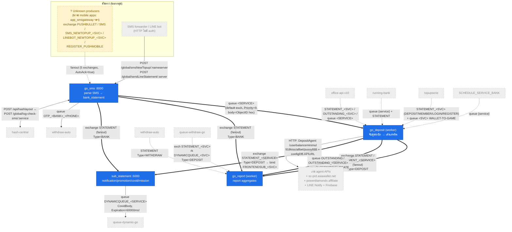
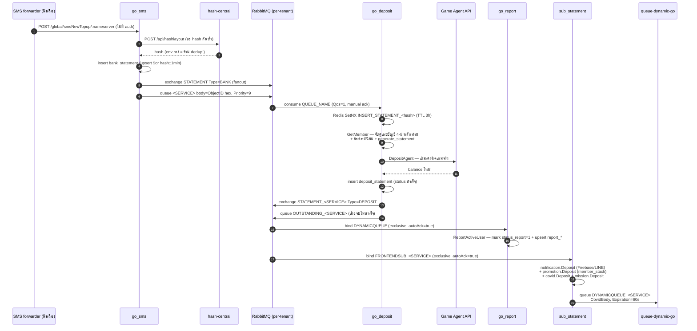

# กลุ่ม: statement-pipeline — ท่อหลักของ "เงินเข้า"

> วิเคราะห์: 2026-06-12 | commit: 40367af | [← กลับหน้าปก](README.md)

**สมาชิก:** `go_sms` (dual-mode :8000 — รับ SMS/slip → `bank_statement`) · `go_deposit` (worker — จับคู่สมาชิก → เติมเครดิต) · `go_report` (worker — sink ของ STATEMENT → report aggregates) · `sub_statement` (subscriber :6000 metrics-only — notification/promotion/covid fan-out)

---

## (ก) บทบาทของกลุ่ม

นี่คือ **ท่อหลักของเงินเข้า (deposit pipeline)** ของทั้งระบบ: SMS แจ้งยอดจากธนาคาร (หรือ LINE bot / Pushbullet / slip) ไหลเข้า `go_sms` → ถูก parse และ dedup เป็นเอกสาร `bank_statement` → `go_deposit` หยิบไปจับคู่กับสมาชิก (เลขบัญชี + ยอดทศนิยม + เวลา) แล้วเติมเครดิตจริงผ่าน game agent API → ผลลัพธ์ fan-out ต่อให้ `go_report` (สร้างรายงานยอด/active user) และ `sub_statement` (แจ้งเตือน Firebase/LINE, สะสมยอดโปรโมชั่น, ค่าคอม covid/affiliate)

**เงินไหลผ่านกลุ่มนี้ = YES** — ทุก message ใน pipeline นี้คือ "เงินจริงของลูกค้า":
- จับคู่สมาชิก**ผิดคน** = เงินเข้าผิดบัญชี (เครดิตเข้า user อื่น)
- message **หาย** = ลูกค้าฝากเงินแล้วเครดิตไม่เข้า (เงินค้าง ต้องตามคืน manual)
- message **ซ้ำ** = เติมเครดิต/แจกโปรโมชั่นซ้ำ (ระบบเสียเงิน)

ทั้ง 4 repo แชร์ข้อมูลผ่าน MongoDB กลาง: collection `database_config` (office DB, credentials hardcode) เป็นจุด discovery ของทุก tenant และ tenant DB ใช้ `bank_statement`/`deposit_statement` ร่วมกันแบบ go_sms (W) → go_deposit (R/W) → go_report (R/W mark `status_report`)

---

## (ข) แผนผังกลุ่ม

> เส้นหนา (`==>`) = ท่อหลักภายในกลุ่ม · เส้นจาง (`-.->`) = producer/consumer ข้ามกลุ่ม · node เหลือง "?" = producer ที่ยังหาต้นทางในโฟลเดอร์ไม่เจอ
> หมายเหตุ topology: ทุก exchange ต่อ message ทั้งหมดวิ่งบน **RabbitMQ ต่อ tenant** (DSN จาก `database_config.RabbitmqURL`) — exchange `STATEMENT` ฝั่ง go_sms ไม่มี suffix แต่แยกกันด้วย broker คนละตัว (go_sms/sms/que-pub.go:55-75)

### Sequence: "SMS ฝากเงิน → เครดิตเข้า"

---

## (ค) ตาราง Edge (หลักฐานสองฝั่ง)

| from | to | ชนิด | exchange/queue + Type จริง | หลักฐานสองฝั่ง (file:line) | conf |
|---|---|---|---|---|---|
| go_sms | go_deposit | MQ queue | queue `<SERVICE>` (default exchange, rk=ชื่อ service, durable, Priority=9, body=ObjectID hex ของ bank_statement) | pub: go_sms/sms/que-pub.go:150-163 → sub: go_deposit/rabbitmq/worker.go:61-86 (env `QUEUE_NAME`) | 🟢 |
| go_sms | go_report | MQ fanout | exchange `STATEMENT` (fanout, durable), Type=`BANK` | pub: go_sms/sms/que-pub.go:55-75 → sub: go_report/rabbitmq/subscribe.go:60-104 (`BANK` → `ReportStatement`) | 🟢 |
| go_sms | sub_statement | MQ fanout | exchange `STATEMENT` (fanout), Type=`BANK` → bind queue `FRONTENDSUB`/`FRONTENDSUB_<SERVICE>` | pub: go_sms/sms/que-pub.go:55-75 → sub: sub_statement/pub/amqp.go:44-88 | 🟢 |
| go_deposit | go_report | MQ fanout | exchange `STATEMENT` / `STATEMENT_<SERVICE>` (เมื่อ `GROUP=NEWTOPUP`), Type=`DEPOSIT`, persistent | pub: go_deposit/deposit/publish.go:33-64 → sub: go_report/rabbitmq/subscribe.go:60-159 (`DEPOSIT` → `ReportActiveUser`) | 🟢 |
| go_deposit | go_report | MQ queue | queue `OUTSTANDING` / `OUTSTANDING_<SERVICE>`, Type=`OUTSTANDINGUPDATE` | pub: go_deposit/deposit/publish.go:96-116 → sub: go_report/rabbitmq/subscribe.go:181-241 | 🟢 |
| go_deposit | sub_statement | MQ fanout | exchange `STATEMENT`/`STATEMENT_<SERVICE>`, Type=`DEPOSIT`/`RE-DEPOSIT` → bind `FRONTENDSUB_<SERVICE>` | pub: go_deposit/deposit/publish.go:33-64 → sub: sub_statement/pub/amqp.go:44-88, :92-118 | 🟢 |
| sub_statement | queue-dynamic-go (ข้ามกลุ่ม → [customer-wallet](customer-wallet.md)) | MQ queue | queue `DYNAMICQUEUE_<SERVICE>` (default exchange, Type=ชื่อ queue, **Expiration=60000ms**), payload `CovidBody` | pub: sub_statement/covid/publish.go:33-55 → sub: queue-dynamic-go | 🟢 |
| go_sms | withdraw-auto (ข้ามกลุ่ม → [bank-automation](bank-automation.md)) | MQ queue | queue `OTP_<BANKCODE>_<PHONE>` (durable) | pub: go_sms/sms/publish.go:159-236 (เรียกจาก sms.go:1501) → sub: withdraw-auto | 🟢 |
| go_sms | hash-central (ข้ามกลุ่ม → [office-core](office-core.md)) | HTTP out | `POST /api/hashlayout` (ไม่มี auth) | go_sms/service/hashCentral/main.go:13-44 | 🟢 |
| hash-central | go_sms | HTTP in | `POST /global/log-check-sms/:service` | go_sms/sms/route.go:26; sms/checked.go:22 | 🟢 |
| office-api-v10 (จาง) | go_deposit / go_report | MQ | exchange `STATEMENT_<SERVICE>` + queue `OUTSTANDING_<SERVICE>` + queue `<SERVICE>` | producer ฝั่ง office-api-v10 → consumer ตาม edge ข้างบน | 🟢 |
| running-bank (จาง) | go_deposit | MQ | queue `{service}` + exchange `STATEMENT` | producer ฝั่ง running-bank → go_deposit/rabbitmq/worker.go:61-86 | 🟢 |
| withdraw-auto (จาง) | go_report | MQ fanout | exchange `STATEMENT`, Type=`WITHDRAW` → `ReportWithdraw` | go_report/rabbitmq/subscribe.go:137-159 | 🟢 |
| topupserie (จาง) | go_deposit / go_report / sub_statement | MQ | exchange `STATEMENT_<SERVICE>` (Types `DEPOSIT`/`MEMBER`/`LOGIN`/`REGISTER`...) + queue `<SERVICE>` Type=`WALLET-TO-GAME` | consumer: go_deposit/rabbitmq/worker.go:71-76 (`WALLET-TO-GAME` → `WorkerWalletSystem`); go_report/subscribe.go:60-159 | 🟢 |
| SCHEDULE_SERVICE_BANK (จาง) | go_deposit | MQ queue | queue `{service}` | → go_deposit/rabbitmq/worker.go:61-86 | 🟢 |
| queue-withdraw-go (จาง) | go_report | MQ | exchange `STATEMENT_<SERVICE>` rk `DYNAMICQUEUE_<SERVICE>`, Type=`DEPOSIT` | → go_report/rabbitmq/subscribe.go:60-104 | 🟢 |
| ? Unknown (น่าจะ mobile apps) | go_sms | MQ fanout | exchanges `PUSHBULLET` / `SMS` / `SMS_NEWTOPUP_<SERVICE>` / `LINEBOT_NEWTOPUP_<SERVICE>` / `REGISTER_PUSHMOBILE` | sub: go_sms/controller/que-sub.go:150-250 — **ไม่พบ producer ในโฟลเดอร์** | 🟡 |
| go_deposit | game agents / wallet (external) | HTTP out | 918kiss/allbet/pussy888 hardcode + `configDatabase.APIURL`; `sc-prd.asiawallet.net` (SUPERCOMPANY); powerdiamonds affiliate; LINE Notify; Firebase RTDB | go_deposit/deposit/agent.go:28-97, :255-260, :571-594; deposit.go:1100-1119; helpermethod/helper.go:11-23; firbase.go:19-34 | 🟢 |

**Shared-data (ไม่ใช่ edge แต่ผูกกันแน่น):** ทั้ง 4 repo อ่าน `database_config` จาก office DB ตัวเดียวกันด้วย **credentials hardcode ชุดเดียวกัน** (go_sms/db/db.go:67, go_deposit/db/db.go:64-68, go_report/db/db.go:58) และแชร์ tenant DB: `bank_statement` (go_sms **W** → go_deposit **R/W** status → go_report **R/W** mark `status_report` — report/statement.go:24-27), `deposit_statement` (go_deposit **W** → go_report **R/W** `UpdateStatusReport` — report/repository.go:242-266 → sub_statement **R** ตอน RECREATE replay — server.go:139)

---

## (ง) Key Flows

### Flow 1: SMS-to-credit (ท่อเงินเข้าหลัก)

1. มือถือ forwarder ยิง `POST /global/smsNewTopup/:nameserver` เข้า go_sms — **ไม่มี auth ที่ route** (go_sms/sms/route.go:24) หรือ message มาทาง exchange `SMS_NEWTOPUP_<SERVICE>` (que-sub.go:190-217, AutoAck=true)
2. go_sms เรียก hash-central `POST /api/hashlayout` ขอ hash กันซ้ำ — ถ้า env `HASH_CENTRAL` ว่างจะ**ข้ามและคืน statement ไม่มี hash** (service/hashCentral/main.go:14-18)
3. parse SMS → upsert `bank_statement` ด้วย `$setOnInsert` + `$or` hash/±1นาที (sms/repository.go:236-287); SMS เก่ากว่า 48 ชม. ทิ้งเงียบ (que-sub.go:546-555)
4. publish คู่: exchange `STATEMENT` Type=`BANK` (que-pub.go:55-75) + queue `<SERVICE>` body=ObjectID hex, Priority=9 (que-pub.go:150-163)
5. go_deposit consume queue (Qos=1, **manual ack** — worker.go:78-86, :127-132) → Redis `SetNX INSERT_STATEMENT_<hash>` TTL 3 ชม. กันซ้ำ (deposit/deposit.go:213-248)
6. `GetMember` จับคู่สมาชิก: เลขบัญชี 4-8 หลักท้าย → ยอดทศนิยม+เวลาใน `generate_statement` → fallback หลายชั้น (deposit/member.go:20-110); เคสบัญชีซ้ำเช็คเฉพาะเมื่อ `CHECK_BANK=v2` (member.go:114)
7. `DepositAgent` เรียก game agent API เติมเครดิตจริง (deposit/agent.go:255-260) → insert `deposit_statement` → publish `STATEMENT_<SERVICE>` Type=`DEPOSIT` (publish.go:33-64); ถ้าจบไม่สำเร็จ → queue `OUTSTANDING_<SERVICE>` (publish.go:96-116) + goroutine `CheckStatus` ตามเก็บเงินค้างย้อนหลัง 48 ชม. (deposit/checkstatus.go:17-48)

### Flow 2: statement-to-report

1. go_report bind exchange `STATEMENT_<SERVICE>` เข้า queue `DYNAMICQUEUE` (**durable=false, exclusive=true, autoAck=true** — subscribe.go:71-104)
2. Type=`BANK` → `ReportStatement` mark `bank_statement.status_report` (report/statement.go:24-27); Type=`DEPOSIT` → `ReportActiveUser` ใช้ `UpdateStatusReport` (`status_report=1`, ModifiedCount==1 จึงประมวลผล) เป็น dedup gate (report/repository.go:242-266) → upsert `report_active_user_day/hour/month/week` แบบ `$inc`
3. queue `OUTSTANDING_<SERVICE>` → `UpdateTodayOutstanding` push datetime ลง Redis list `outstanding_deposit_statement` + debounce (reportOld/cronjob.go:241-277) → cron ทุก 5 นาที `outStandingUpdateReport2` ดึงสูงสุด 5000 รายการมา recompute (cronjob.go:74-206)
4. ชดเชย message หายจาก autoAck: cron รายชั่วโมง `StartRecovery` → `ReportRemain` ย้อนหลัง 1 วัน (cronjob.go:35, :55-72) — แต่ recovery สร้างรายงานซ้ำได้ จึงต้องมี cron 02:00 `ManageDuplicateReportActiveUser` ลบซ้ำทุกวัน (cronjob.go:36)

### Flow 3: deposit-to-promotion-notification

1. sub_statement bind exchange `STATEMENT`/`STATEMENT_<SERVICE>` เข้า queue `FRONTENDSUB_<SERVICE>` (**exclusive, durable=false, autoAck=true** — pub/amqp.go:61-88)
2. Type=`DEPOSIT` วิ่ง 4 handler ตามลำดับใน goroutine เดียว (amqp.go:92-118): `notification.Deposit` (Firebase RTDB PUT + LINE noti, fire-and-forget) → `promotion.Deposit` (upsert `member_stack` สะสมยอด, แจก ticket — ObjectID ใหม่ทุกครั้ง ไม่มี dedup ระดับ message — promotion/deposit.go:74-76) → `covid.Deposit` → `mission.Deposit`
3. `covid.Deposit` คำนวณค่าคอม → publish queue `DYNAMICQUEUE_<SERVICE>` พร้อม `Expiration=60000` (covid/publish.go:33-55) ให้ queue-dynamic-go ([customer-wallet](customer-wallet.md)) ตัดเครดิตจริง — **consumer หยุดเกิน 60 วิ = ค่าคอมหมดอายุหายเงียบ**
4. Type=`RE-DEPOSIT` วิ่ง `promotion.Deposit` + `covid.Deposit` ซ้ำเส้นทางเดียวกับ `DEPOSIT` โดยไม่มี flag กันซ้ำ (amqp.go:112-114)

---

## (จ) Risk Register

### หมวด 1 — ความถูกต้องของเงิน (เงินเข้าผิดบัญชี / เงินหาย)

| # | ความเสี่ยง | ระดับ | file:line | ผลกระทบ | ข้อเสนอ |
|---|---|---|---|---|---|
| 1.1 | จับคู่สมาชิกแบบ fallback หลายชั้น (เลขบัญชี 4-8 หลักท้าย → ยอดทศนิยม+เวลา) เจอ 1 คนตรงเงื่อนไข = เติมเครดิตทันที; เคสชื่อบัญชีซ้ำ/บัญชีเพิ่มใหม่กันไว้**เฉพาะเมื่อ env `CHECK_BANK=v2`** | 🔴 | go_deposit/deposit/member.go:20-110, :114; repository.go:386, :464 | เลขบัญชีท้ายชนกันระหว่าง 2 สมาชิก = เงินเข้าผิดคน (เงินจริง, กู้คืนยาก) | บังคับ CHECK_BANK=v2 ทุก tenant, จับคู่ด้วยเลขบัญชีเต็ม + ชื่อบัญชี, เคสกำกวมส่ง manual review แทน auto-credit |
| 1.2 | Idempotency เคส `AccBankCode=="XXXXXXXXX"` พึ่ง Redis SetNX อย่างเดียว — hash = วันที่+ยอด+เลขบัญชี (ไม่มีเวลา) TTL 3 ชม.: ฝากยอดเท่ากันซ้ำใน TTL ถูกบล็อกเป็น duplicate, พ้น TTL ผ่านได้; **Redis error → return เงียบ + message ถูก ack ทิ้ง** | 🔴 | go_deposit/deposit/deposit.go:212-248 (Redis error :229-232), :1172-1179 | Redis ล่มช่วงสั้น = รายการฝากหายเงียบทั้งช่วง; ลูกค้าฝากยอดเดียวกันวันเดียวกันถูกตีเป็นซ้ำ | Redis error ต้อง nack/requeue ไม่ใช่ ack; เพิ่ม unique index ใน deposit_statement เป็นชั้นที่สอง |
| 1.3 | dedup ของ statement พึ่ง hash-central: env `HASH_CENTRAL` ว่าง = **ข้าม dedup ทั้งหมด** คืน statement ไม่มี hash (`return stm, nil`) | 🔴 | go_sms/service/hashCentral/main.go:14-18; เช็ค hash ว่างเฉพาะ que-sub.go:524-533 | config ผิดตัวเดียว = SMS เดิม insert ซ้ำ = เติมเครดิตซ้ำ | env ว่างต้อง fail-fast ตอน start ไม่ใช่ silently skip |
| 1.4 | `DYNAMICQUEUE_<SERVICE>` ตั้ง `Expiration="60000"` — consumer (queue-dynamic-go) หยุดเกิน 60 วิ ค่าคอม covid/affiliate หมดอายุหายเงียบ (publish error แค่ println) | 🔴 | sub_statement/covid/publish.go:46 (:33-55); error :48-51 | ค่าคอมหายโดยไม่มีร่องรอย ตรวจย้อนไม่ได้ | ถอด Expiration หรือเพิ่ม DLX + ตาราง pending ใน DB ให้ replay ได้ |
| 1.5 | sub_statement promotion ไม่มี dedup ระดับ message (`primitive.NewObjectID()` ทุกครั้ง) + `RE-DEPOSIT` วิ่ง handler เดียวกับ `DEPOSIT` ซ้ำ; RECREATE replay เช็ค hash เฉพาะ `member_stack.statement_deposit.hash` | 🟠 | sub_statement/promotion/deposit.go:74-76, :588-601; pub/amqp.go:112-114; server.go:146-153 | message ซ้ำ/replay = ยอดสะสมโปรโมชั่น stack ซ้ำ → แจก ticket/โบนัสเกิน | ใช้ hash ของ statement เป็น idempotency key ทุก handler |

### หมวด 2 — Message loss / duplication (acknowledgement)

| # | ความเสี่ยง | ระดับ | file:line | ผลกระทบ | ข้อเสนอ |
|---|---|---|---|---|---|
| 2.1 | **autoAck=true ใน 3 จาก 4 repo**: go_sms ทุก consumer (handler error แค่ `log.Printf`), go_report ทั้ง 2 consumer (มี comment ไทยยอมรับเอง "อาจต้องปิด auto-ack เป็น false"), sub_statement | 🔴 | go_sms/controller/que-sub.go:86, :133-135, :157, :176, :197, :225; go_report/rabbitmq/subscribe.go:98, :236; sub_statement/pub/amqp.go:61-88 | pod ตายกลาง handler = message หายถาวร ไม่มี retry/DLQ — ฝั่ง go_sms คือ SMS ฝากเงินหายก่อนเข้า bank_statement | เปลี่ยนเป็น manual ack + Qos แบบ go_deposit; เพิ่ม DLX |
| 2.2 | go_deposit `d.Ack(false)` ถูกเรียก**เสมอ**แม้ WorkerDeposit fail ภายใน (ทุก error path return เฉย ๆ) — ไม่มี retry/DLQ | 🔴 | go_deposit/rabbitmq/worker.go:127-132 | เติมเครดิตล้มเหลว (agent timeout ฯลฯ) → message หาย เหลือเพียง CheckStatus loop สุ่ม 1-7 นาทีตามเก็บเคส status 5/6 เท่านั้น | nack+requeue พร้อม retry counter; เคสเกิน N ครั้งเข้า DLQ ให้คนตรวจ |
| 2.3 | go_report queue `exclusive=true, durable=false` — restart/reconnect = queue หาย message ช่วงดับสูญทั้งหมด; ชดเชยด้วย cron recovery รายชั่วโมงซึ่ง**สร้างรายงานซ้ำ**จนต้องมี cron 02:00 ลบซ้ำอีกตัว (สถาปัตยกรรมยอมรับความซ้ำเป็นปกติ) | 🟠 | go_report/rabbitmq/subscribe.go:71-78, :216-223; reportOld/cronjob.go:35-36, :55-72 | รายงานคลาดเคลื่อนได้สูงสุด 1 ชม. + ช่วงก่อน 02:00 มีรายงานซ้ำ | queue durable + named; ถ้าจะคง recovery ให้ recompute แบบ idempotent (replace ไม่ใช่ `$inc`) |

### หมวด 3 — Availability / recovery

| # | ความเสี่ยง | ระดับ | file:line | ผลกระทบ | ข้อเสนอ |
|---|---|---|---|---|---|
| 3.1 | sub_statement `MQReconnector` reconnect connection แล้ว `recon=false` จบ loop **โดยไม่เรียก `StartAMQP` ซ้ำ** — consumer ตายถาวรแต่ process/health ดูปกติ | 🔴 | sub_statement/_config/mq.go:43-53 (recon=false :51); server.go:90-91 | RabbitMQ rotate หนึ่งครั้ง = notification/promotion/covid เงียบทั้ง tenant แบบไม่มี alert | re-subscribe ใน reconnect loop + liveness probe ที่เช็ค consumer count |
| 3.2 | go_deposit `failOnError` เป็น no-op (body ถูก comment) — declare/consume fail เดินต่อเงียบแล้วค่อยตายตอน `for d := range msgs`; `ConnectRabbit` maxRetry 500×2s แล้ว return เงียบ process อยู่ต่อแบบไม่มี consumer | 🟠 | go_deposit/rabbitmq/worker.go:16-20, :57-88; connection.go:55-58; _cmd/main.go:45-48 | worker เงินเข้าหยุดทำงานแบบเงียบ | คืน fatal behavior + exit code ให้ orchestrator restart |
| 3.3 | go_deposit `Reconnector` เรียก `Worker` ใหม่โดยไม่หยุด goroutine `CheckStatus` รอบเก่า → loop ซ้อนหลายตัวหลัง reconnect; `HealthCheckDatabase` fail 5 ครั้ง → `panic` ฆ่า in-flight message | 🟠 | go_deposit/rabbitmq/connection.go:82-95; worker.go:98; db/db.go:207-211 | CheckStatus ซ้อนกันยิง DepositAgent เติมเครดิตซ้ำเคสเงินค้างพร้อมกันได้ (Mongo MaxPoolSize=1/3 ยิ่งช้า — db.go:82, :156) | context cancel goroutine เก่าก่อน reconnect; graceful shutdown |
| 3.4 | go_report connect RabbitMQ มี sleep 30s ทุกครั้งรวม reconnect + maxRetry=100 แล้ว return เงียบ; go_sms ก็มี start delay 30s + sleep 200ms/message ใน hot path | 🟡 | go_report/rabbitmq/connection.go:34-43; go_sms/app-serv.go:44; que-sub.go:303-305 | window ของ message หาย (ประกอบ 2.3) ยาวขึ้น 30s+ ทุก rotate; throughput ต่ำ | ตัด fixed sleep, ใช้ backoff จริง |

### หมวด 4 — Security / secrets

| # | ความเสี่ยง | ระดับ | file:line | ผลกระทบ | ข้อเสนอ |
|---|---|---|---|---|---|
| 4.1 | SMS ingestion ไม่มี auth: `POST /global/createSMS`, `/global/smsNewTopup/:nameserver` ฯลฯ เปิดสาธารณะ — SMS ปลอม = bank_statement ปลอม = ขอเครดิตจริง; `/sendLineStatement` ใช้ IP allowlist จาก header `CF-Connecting-IP` ซึ่ง**ปลอมได้ถ้า origin ไม่ถูกบังคับผ่าน Cloudflare** และค่าว่าง/`" "`/localhost ผ่านได้ | 🔴 | go_sms/sms/route.go:21-27; middleware/authHeader.go:13-18, :63-66 | ผู้รู้ format SMS ธนาคารยิงรายการฝากปลอมได้ — ชั้นป้องกันที่เหลือคือการจับคู่ยอด/บัญชีใน go_deposit เท่านั้น | บังคับ API key/HMAC ทุก ingestion route; เช็ค CF header เฉพาะหลัง verify ว่า traffic มาจาก CF จริง |
| 4.2 | broker credentials hardcode 3 ชุดใน executing path ของ go_sms (CloudAMQP ×2 + EC2 `abaofficerabbitmq:Zxcvasdf789@52.77.27.18`) ซ้ำใน legacy publish.go | 🔴 | go_sms/controller/manage-que.go:20-22; sms/publish.go:240, :300, :356 | ใครเข้าถึง repo publish statement ปลอมเข้า broker ตรง ๆ ได้ (ข้าม HTTP layer ทั้งหมด) | rotate ทุกชุด, ย้ายเข้า secret manager |
| 4.3 | Mongo credentials hardcode + `.env` commit ทั้ง 3 repo (office DocumentDB `abaoffice:zxcvasdf789@...` ชุดเดียวกัน; Atlas root; CloudAMQP); LINE Notify token + Sentry DSN + Telegram bot token+chat id hardcode; JWT จริงของ user ค้างใน comment | 🔴 | go_sms/db/db.go:67, :129; go_deposit/db/db.go:64-68 + .env:2-3, :11 + helpermethod/helper.go:23 + firbase.go:41; go_report/db/db.go:58 + .env:5, :8 + report/script.go:2549-2554; sub_statement/.env:3, :5 | DB กลางที่ถือ `database_config` ของทุก tenant หลุดจุดเดียว = ยึดได้ทั้งระบบ | rotate + secret manager + ลบ .env ออกจาก git history |

### หมวด 5 — สถาปัตยกรรม / dependency เดี่ยว

| # | ความเสี่ยง | ระดับ | file:line | ผลกระทบ | ข้อเสนอ |
|---|---|---|---|---|---|
| 5.1 | dedup ทั้ง pipeline แขวนอยู่บน hash-central ตัวเดียว (เรียกแบบไม่มี auth, ไม่มี circuit breaker) + ชั้นใน DB เป็น `$or` hash±1นาที | 🟠 | go_sms/service/hashCentral/main.go:13-44; sms/repository.go:256-262 | hash-central ล่ม/ช้า = ingestion ช้าทั้งระบบหรือ dedup รั่ว (ประกอบ 1.3) | dedup หลักควรเป็น unique index ฝั่ง DB; hash-central เป็น optimization |
| 5.2 | `database_config` (office DB) เป็น discovery กลางของทั้ง 4 repo — sync ทุก 30s ฝั่ง go_sms, reload เฉพาะตอนได้ message `UPDATECONFIG` ฝั่ง go_deposit | 🟡 | go_sms/controller/manage-que.go:43-103; go_deposit/rabbitmq/worker.go:71-76, :113 | แก้ config ผิด tenant เดียวกระทบ broker/DB routing ของ pipeline ทั้งเส้น; office DB MaxPoolSize=1 เป็น SPOF | แยก config service + validation ก่อน apply |
| 5.3 | legacy code สองชุดทำงานคู่กันใน go_sms (streadway `sms/publish.go` ยังถูกเรียกจริงที่ sms.go:1501, :1718 — `amqp.Dial` ต่อ message, error ถูกกลืนไม่ log) | 🟡 | go_sms/sms/publish.go:16-20, :41-44, :63-66; sms/sms.go:1501, :1718 | OTP queue (จ่ายให้ withdraw-auto) ส่งไม่ถึงแบบเงียบเมื่อ broker สะดุด | migrate OTP path มาใช้ que.Manager เดียวกัน |
| 5.4 | external call ไม่มี timeout หลายจุดบน critical path: powerdiamonds tracking (`http.Client{}`), LINE Notify; go_deposit ประมวลผล sequential (Qos=1) — agent ค้าง = ทั้งคิวค้าง | 🟡 | go_deposit/deposit/deposit.go:1100-1119 (:1108); helpermethod/helper.go:16 | คิวเงินเข้า stall เพราะ third-party เดียว | ตั้ง timeout ทุก client; ย้าย tracking/notify ออกนอก critical path |

### ✅ ตรวจแล้วผ่าน (สิ่งที่ทำถูก — อย่าทำพังตอน rewrite)

- **go_deposit ใช้ manual ack + Qos prefetch=1** — ตัวเดียวในกลุ่มที่ ack หลัง process (go_deposit/rabbitmq/worker.go:78-86, :127-132) — ปัญหาคือ "ack แม้ fail" (2.2) ไม่ใช่กลไก ack เอง
- **Redis lock `INSERT_STATEMENT_<hash>` ด้วย SetNX** เป็น cross-instance lock ที่ถูกหลักการ (go_deposit/deposit/deposit.go:213-248) — จุดอ่อนคือ error handling กับ hash ไม่มีเวลา ไม่ใช่ตัว lock
- **go_sms insert `bank_statement` แบบ upsert `$setOnInsert` + `$or` hash/±1นาที** — มี dedup ชั้น DB จริง (go_sms/sms/repository.go:236-287)
- **go_report ใช้ `UpdateStatusReport` (ModifiedCount==1) เป็น atomic dedup gate** ต่อ document ก่อน aggregate (go_report/report/repository.go:242-266)
- **go_report `failOnError` = `log.Fatalf`** — fail-fast ตอน declare ผิด (subscribe.go:16-20) ดีกว่า no-op ของ go_deposit
- **มี compensation loop จริง**: go_deposit `CheckStatus` ตามเก็บเงินค้าง 48 ชม. (checkstatus.go:17-48); go_report cron recovery รายชั่วโมง (cronjob.go:35) — ออกแบบ "ยอมหายแล้วชดเชย" อย่างตั้งใจ แม้จะไม่ใช่วิธีที่ควรเป็น
- **go_sms duplicate-window เวลา [-48h, now]** กัน SMS replay เก่า (que-sub.go:546-555)

### ❓ ข้อสงสัย (ยังไม่ยืนยัน)

- go_deposit `.env:15` ตั้ง `QUEUE_NAME=DEPOSIT` แต่ producer (go_sms) publish เข้า queue ชื่อ `<SERVICE>` — เดาว่า production override env เป็นชื่อ service ต่อ pod (.env เป็นค่า dev) แต่**ไม่มีหลักฐาน deployment manifest ในโฟลเดอร์** — ถ้า config คลาดกัน queue จะถูก declare แยกและ message ไม่ถึง worker
- go_report `.env:14` `EXCHANGE_NAME=STATEMENT_DEMO-DEV` vs go_sms publish เข้า `STATEMENT` เปล่า ๆ (คนละชื่อ) — น่าจะแยกด้วย per-tenant broker + env ต่อ deployment เช่นกัน ยังไม่เห็นค่า production จริง
- `SUB_OLD` / `GET_OLD` / `RECREATE=TRUE` mode ของ go_report และ sub_statement — เป็น migrate/replay mode ที่รันมือ ไม่รู้ว่ายังใช้อยู่หรือไม่
- sub_statement `.env:8 SERVICEAPI=http://autogroup-joker.api-th.com/...` — ไม่พบจุดใช้ใน executing path
- go_report `reportSMSDeposit` → `mongo-sms.api-node.com` จุดเรียกถูก comment (report/deposit.go:243) — น่าจะ dead code แต่ฟังก์ชัน+URL ยังอยู่

---

## (ฉ) Unknown / นอกขอบเขตโฟลเดอร์

| สิ่งที่ไม่รู้ | บริบท | evidence ฝั่งที่มี |
|---|---|---|
| producers ของ exchange `PUSHBULLET`, `SMS`, `SMS_NEWTOPUP_<SERVICE>`, `LINEBOT_NEWTOPUP_<SERVICE>`, `REGISTER_PUSHMOBILE` | go_sms (subscriber mode) consume 5 exchange นี้ แต่ไม่พบ producer ใน 25 repo — น่าจะเป็น mobile apps นอกโฟลเดอร์ (เช่น `app_smsgateway` / `app_notification` ใน monorepo Maximumsoft เดิม) ที่ forward SMS/Pushbullet/device token เข้า broker ตรง | go_sms/controller/que-sub.go:150-250 |
| `mongo-sms.api-node.com` | go_report มีโค้ด `POST /v1/logSMSByPhoneNumber/<SERVICE>` แต่จุดเรียกถูก comment — service ปลายทางไม่อยู่ในโฟลเดอร์ | go_report/report/deposit.go:243, :346-352 |
| `allapi.topupoffice.com` | go_sms ใช้เป็น discovery RabbitMQ URL ต่อ group (`GetRabByName`, `GetVersionRabbit`, custom encrypted auth header) — ตัว service ไม่อยู่ในโฟลเดอร์ | go_sms/helper/all_api.go:12, :39-56 |
| `monitor.thezeus.online`, `console.sms-kub.com`, `sendsms.lupin.host`, game agent APIs (`*.api-node.com`, `*.api-th.com`), `sc-prd.asiawallet.net`, `affiliate.powerdiamonds.xyz` | external SaaS/บริการนอกระบบ — สถานะยังเปิดอยู่หรือไม่ ไม่ทราบ | go_sms/sms/firebase.go:33; sub_statement/promotion/deposit.go:1206, :1226; go_deposit/deposit/agent.go:28-97 |

---

**กลุ่มที่เกี่ยวข้อง:** [office-core](office-core.md) (office-api-v10, hash-central) · [bank-automation](bank-automation.md) (withdraw-auto, running-bank, SCHEDULE_SERVICE_BANK) · [customer-wallet](customer-wallet.md) (queue-dynamic-go, queue-withdraw-go, topupserie) · [game-lotto](game-lotto.md)
