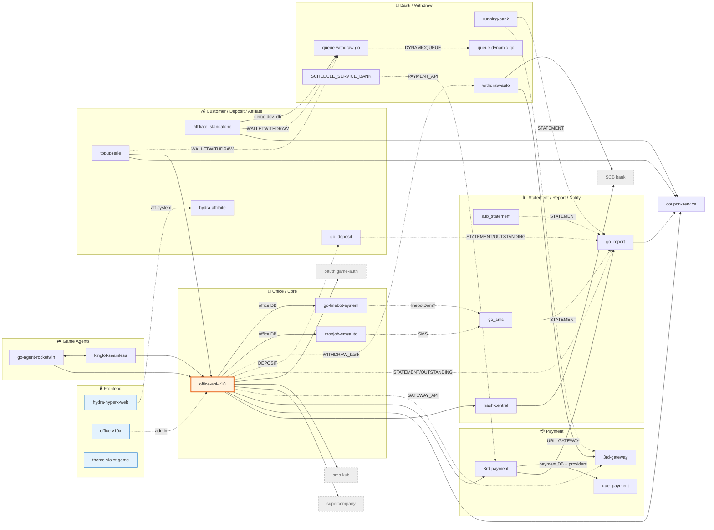

# 🗺️ Repo Relationship Map — genesis-all-in-one

> สร้างจากหลักฐานในไฟล์จริง (go.mod / .env / config / โค้ด Go / nuxt plugins / docker-compose / workflows) — ไม่ใช่การเดา
> อัปเดต: 2026-06-11

## ภาพรวมสถาปัตยกรรม

- **ไม่มี code import ข้าม repo เลย** — ทุก Go service เป็น module อิสระ (`app`, `goofficev10`, `coupon`, ...) และ frontend เป็น Nuxt app แยก
- dependency ภายในองค์กรเดียวที่ใช้ร่วมคือ published lib `github.com/Maximumsoft-Co-LTD/otelgo` (observability) — ไม่ใช่ repo ในโฟลเดอร์นี้
- ความสัมพันธ์ทั้งหมดเป็น **runtime**: HTTP API call, RabbitMQ messaging, shared MongoDB
- เป็น microservices แบบ **multi-tenant** — queue/exchange/DB ต่อท้ายด้วย `_<SERVICE>` (เช่น `STATEMENT_<SERVICE>`)
- CI/CD: ทุก repo มี workflow ของตัวเอง → Kaniko → JFrog (`thezeustech.jfrog.io` / `thezeusthech/*`) → K8s GitOps; **ไม่มี cross-repo pipeline trigger**

### ระดับความเชื่อมั่นของหลักฐาน
- 🟢 **แข็ง** — key/path ชื่อตรงกับ repo เป้าหมาย หรือพบคู่ Publish↔Consume/QueueBind ชัดเจน
- 🟡 **อ่อน/(?)** — อ้างอิงจาก domain/host ภายนอก, ค่าที่ถูก comment, หรือ config ที่ inject ตอน runtime

---

## 1. Inventory (25 repos)

| Repo | ภาษา (module) | ประเภท | Build |
|------|---------------|--------|-------|
| office-api-v10 | Go (`goofficev10`) | backend service ⭐ **hub** | Dockerfile, pipeline.yml |
| go_report | Go (`goreport`) | backend service (statement **sink**) | Dockerfile, build.yaml |
| coupon-service | Go (`coupon`) | backend service (fan-in) | Dockerfile, build.yaml |
| hash-central | Go (`app`) | backend service (hash slip/statement) | Dockerfile, workflow.yaml |
| 3rd-payment | Go (`app`) | backend service (payment — sync API) | Dockerfile, build.yaml |
| que_payment | Go (`app`) | backend worker (payment — async) | Dockerfile, build.yaml |
| 3rd-gateway | Go (`app`) | backend service (gateway config) | Dockerfile, build.yaml |
| go_deposit | Go (`godeposit`) | backend worker (deposit) | Dockerfile, pipeline.yml |
| go_sms | Go (`sms`) | backend service (SMS pub/sub) | Dockerfile, build.yaml |
| topupserie | Go (`topupserie`) | backend service (customer/topup) | Dockerfile, pipeline.yml |
| affiliate_standalone | Go (`affiliate`) | backend service | Dockerfile, build.yaml |
| go-agent-rocketwin | Go (`agentnewtopup`) | backend service (game agent) | Dockerfile, pipeline.yml |
| kinglot-seamless | Go (`kinglot`) | backend service (seamless wallet) | Dockerfile, pipeline.yml |
| running-bank | Go (`app`) | backend service (bank statement scraper) | Dockerfile, build.yaml |
| withdraw-auto | Go (`app`) | backend service (bank automation) | Dockerfile, cicd.yml |
| queue-withdraw-go | Go (`queuework`) | backend worker (withdraw queue) | Dockerfile, build.yaml |
| queue-dynamic-go | Go (`queuework`) | backend worker (dynamic queue forwarder) | Dockerfile, pipeline.yaml |
| sub_statement | Go (`statementPub`) | backend service (statement publisher) | Dockerfile, build.yaml |
| cronjob-smsauto | Go (`smsauto`) | tool / cronjob | Dockerfile, build.yaml |
| SCHEDULE_SERVICE_BANK | Go (`servicebank`) | tool / cronjob (bank trigger) | Dockerfile, build.yaml |
| go-linebot-system | Go (`linebot`) | backend service (LINE bot) | Dockerfile, build.yaml |
| hydra-affilaite | Go (`hydra`) | backend service (aff-system) | Dockerfile, build.yaml |
| hydra-hyperx-web | Nuxt/JS (`hydra-system`) | **frontend** | Dockerfile, build.yaml |
| office-v10x | Nuxt/JS (`office-v10x`) | **frontend** (admin) | Dockerfile, pipeline.yml |
| theme-violet-game | Nuxt/JS (`ngernn`) | **frontend** (customer) | Dockerfile, pipeline.yml |

---

## 2. Edge List

### 2.1 API calls (caller → callee)

| from | to | conf | หลักฐาน (ไฟล์/key) |
|------|-----|:----:|--------------------|
| office-api-v10 | hash-central | 🟢 | `HASH_CENTRAL_API` → hash-central serve `POST /hashlayout` (office/config, controller) |
| office-api-v10 | coupon-service | 🟢 | `COUPON_SERVICE` (controller) |
| affiliate_standalone | coupon-service | 🟢 | `COUPON_SERVICE` (controller) |
| go_report | coupon-service | 🟢 | `COUPON_SERVICE` (report) |
| topupserie | coupon-service | 🟢 | `COUPON_SERVICE` (controller) |
| topupserie | office-api-v10 | 🟢 | `URL_OFFICE_API` (controller, service) |
| go-agent-rocketwin | office-api-v10 | 🟢 | `APIOFFICE` (controller/kinglot) |
| kinglot-seamless | office-api-v10 | 🟢 | `APIOFFICE` (callback) |
| 3rd-payment | go_report | 🟢 | `API_REPORT` (controller) |
| office-api-v10 | 3rd-payment | 🟢 | `PAYMENT_API/api/v2/...` + `/api/v2/callback-payin/...PEER2PAY` ↔ 3rd-payment route `/api`, `/peer2pay/v3` |
| go-agent-rocketwin | kinglot-seamless | 🟢 | `SEAMLESS_API` + `APICALLBACKLOTTO` (controller/seamless, controller/kinglot) + lotto RPC queue |
| withdraw-auto | 3rd-gateway | 🟢 | `controller/thirdgateway` + `URL_GATEWAY`; 3rd-gateway serve gateway config (`GetListGateway`) |
| office-api-v10 | 3rd-gateway | 🟡 | `GATEWAY_API` (controller) — ไม่ยืนยัน path |
| running-bank | 3rd-gateway | 🟡 | `URL_GATEWAY` (controller/runbankAll) |
| SCHEDULE_SERVICE_BANK | 3rd-payment | 🟡 | `PAYMENT_API` (ctl-update-status-withdraw) |

**External (อยู่นอกชุด repo นี้):**

| from | to (external) | key |
|------|----------------|-----|
| office-api-v10 | supercompany (`sc-prd.asiawallet.net`) | `SUPERCOM_API` |
| office-api-v10 | sms-kub (`uat.sms-kub.com`) — **ไม่ใช่ go_sms** | `SMS_API` |
| office-api-v10 | oauth game-auth (`oauth.game-auth.com`) | `LOGIN_GATEWAY_URL` |
| hash-central, withdraw-auto | SCB bank API | `SCB_SERVICE` |
| 3rd-payment, que_payment | encryption service (external/unknown — **ไม่ใช่ hash-central**) | `ENCRYPTION_ENDPOINT` |

> 🔎 หมายเหตุ `ENCRYPTION_ENDPOINT`: เดิมสงสัยว่าเป็น hash-central แต่ตรวจ route แล้ว hash-central serve เฉพาะ `/hashlayout`, `/bot` (hash ของ slip/statement) ไม่ใช่ card encryption ของ cloudpay/visapay → จัดเป็น external

### 2.2 Async messaging (producer → [exchange/queue] → consumer)

| from | to | conf | exchange/queue + หลักฐาน |
|------|-----|:----:|--------------------------|
| go_deposit | go_report | 🟢 | fanout `STATEMENT` (publish.go:33-35) ↔ go_report `QueueBind` (subscribe.go:87) |
| go_sms | go_report | 🟢 | fanout `STATEMENT` (que-pub.go:62) ↔ go_report bind |
| office-api-v10 | go_report | 🟢 | `STATEMENT` (report/publish.go) + `OUTSTANDING_<SERVICE>` (helper/queue.go:359) |
| running-bank | go_report | 🟢 | `STATEMENT` (report/publish.go) |
| sub_statement | go_report | 🟢 | `STATEMENT` (pub/amqp.go, covid/publish.go) |
| go_deposit | go_report | 🟢 | `OUTSTANDING_<SERVICE>` (publish.go:98) ↔ `SubscribeOutstanding` (subscribe.go:184) |
| affiliate_standalone | queue-withdraw-go | 🟢 | `WALLETWITHDRAW_<SERVICE>` (mainService.go:253) ↔ `QUEUE_NAME=WALLETWITHDRAW` |
| topupserie | queue-withdraw-go | 🟢 | `WALLETWITHDRAW` (mainService.go:476) ↔ consumer |
| office-api-v10 | go_deposit | 🟢 | `PublishDepositStatement`/`PublishRestartDeposit` (bank.go, credit.go) ↔ `QUEUE_NAME=DEPOSIT` |
| office-api-v10 | withdraw-auto | 🟢 | `WITHDRAW_<bank>` (withdraw.go:2873) ↔ withdraw-auto `*/netbank.rabbit.go` consumers |
| queue-withdraw-go | queue-dynamic-go | 🟢 | `DYNAMICQUEUE_<SERVICE>` (helper/wallet.go:92) ↔ pub/amqp.go `Consume` (l.57) |
| go-agent-rocketwin | kinglot-seamless | 🟢 | lotto RPC queue: ทั้งคู่ `rabbitmqlotto/worker` `Consume` + kinglot `PublishQueue` |
| cronjob-smsauto | go_sms | 🟡 | exchange `SMS`/`SMS_NEWTOPUP` (go_sms `SubscribeNewTopup`) — producer ไม่ยืนยัน 100% |
| go-linebot-system | go_sms | 🟡 | go_sms `SubscribeLineBotDom` (que-sub.go:219) — ไม่พบ publish ฝั่ง linebot |

### 2.3 Shared data store (soft — domain level เท่านั้น)

> ⚠️ เกือบทุก repo ชี้ไป cluster dev เดียวกัน (`test02.9oh7e.mongodb.net`) ซึ่งเป็นค่า `.env` dev — **ไม่ลากเส้นตาม cluster** ลากเฉพาะที่ชื่อ DB สื่อ domain เดียวกัน

| repos | conf | หลักฐาน |
|-------|:----:|---------|
| office-api-v10 ↔ cronjob-smsauto ↔ go-linebot-system | 🟡 | DB `*_office` / `demo_office` (office data domain) |
| affiliate_standalone ↔ queue-withdraw-go | 🟡 | DB `demo-dev_db` |
| 3rd-payment ↔ que_payment | 🟡 | provider packages เหมือนกันทุกตัว (anypay, askmepay, cloudpay, bitpayz...) + `ENCRYPTION_ENDPOINT` ร่วม → คู่ sync/async |

### 2.4 Frontend → backend (runtime-injected, หลักฐานอ่อน)

> API base ของ frontend ถูก inject ตอน deploy ผ่าน k8s (ไม่ฮาร์ดโค้ดใน repo) — เส้นด้านล่างมาจาก baseURL ที่ถูก comment ไว้ในโค้ด/plugin

| from | to | conf | หลักฐาน |
|------|-----|:----:|---------|
| hydra-hyperx-web | hydra-affilaite | 🟡 | plugin: `$axios.setBaseURL('https://aff-system.warmlight.online')`, `demo-uat.hydra-affiliate.com/api` (aff-system = image ของ hydra-affilaite) |
| office-v10x | office-api-v10 | 🟡 | baseURL dev `localhost:5053`/`4173` (admin frontend ของ office) |
| theme-violet-game | customer backend | 🟡 | API base inject runtime — ปลายทางเฉพาะยังไม่ยืนยัน |

---

## 3. Mermaid Diagram

> Mermaid ไม่มีไวยากรณ์เส้นจุดแยกจากเส้นประในกราฟเดียว — shared-db จึงใช้ label `DB` กำกับบนเส้น, event ใช้เส้นประพร้อมชื่อ exchange/queue

---

## 4. สรุป: Hub & Orphan

### 🌟 Hubs (degree สูงสุด)

1. **`office-api-v10`** — hub กลางชัดเจน (degree ~16)
   - **out:** hash-central, coupon, 3rd-payment, 3rd-gateway, supercompany/sms-kub/game-auth (ext) + ป้อน queue: go_deposit (`DEPOSIT`), withdraw-auto (`WITHDRAW`), go_report (`STATEMENT`/`OUTSTANDING`)
   - **in:** topupserie, go-agent-rocketwin, kinglot-seamless (`APIOFFICE`/`URL_OFFICE_API`), office-v10x (frontend)
2. **`go_report`** — statement **sink** (in-degree สูงสุด): รับ `STATEMENT`/`OUTSTANDING` จาก go_deposit, go_sms, office, running-bank, sub_statement + เรียก coupon + ถูกเรียกโดย 3rd-payment
3. **`coupon-service`** — fan-in hub: ถูกเรียกโดย office, affiliate, go_report, topupserie

### 🔗 คู่ที่ coupling แน่น
- **3rd-payment ↔ que_payment** — payment sync/async คู่กัน (provider packages เหมือนกันทั้งหมด + DB ร่วม)
- **go-agent-rocketwin ↔ kinglot-seamless** — game agent + seamless wallet (HTTP สองทาง + lotto RPC queue)
- **office → go_report** — ผ่านทั้ง queue หลายเส้นและ statement pipeline

### 🔸 Connectivity ต่ำสุด (ไม่มี orphan แท้แล้ว)
- **go-linebot-system** — เชื่อมแบบอ่อน: go_sms `SubscribeLineBotDom` + อยู่ใน office DB domain
- **SCHEDULE_SERVICE_BANK** — มีเฉพาะเส้น 🟡 → 3rd-payment (`PAYMENT_API`)
- **theme-violet-game** — frontend ที่ปลายทาง backend ยังไม่ยืนยันจากไฟล์
- **hydra-affilaite** — เดิมเป็น orphan แต่ resolve แล้วเป็น backend ของ hydra-hyperx-web (aff-system)

### ⚠️ ข้อจำกัดของหลักฐาน
- Frontend ทั้ง 3 ตัว inject API base ตอน runtime (k8s) — เส้นไป backend จึงเป็น 🟡 จาก baseURL ที่ถูก comment ไว้ ไม่ใช่ orphan
- shared-DB เป็น domain-level inference เท่านั้น (cluster dev ใช้ร่วมกันเกือบหมด ไม่ลากตาม cluster)
- ค่าใน `.env` เป็น dev/uat — host จริงตอน production อยู่ใน k8s manifest (ไม่อยู่ใน repo เหล่านี้)
